# Immersion Day Lab 1 - Ingest Data into a Kinesis Data Stream

In this section, we create an Amazon Kinesis Data Stream and populate the stream using a historic data set of taxi trips made in NYC.

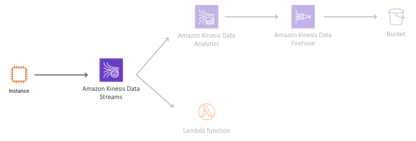

###  1.	Navigate to the Amazon Kinesis services and press Get Started when prompted (you may not need to complete this, if you have already used Amazon Kinesis). Select Create data stream to navigate to the Amazon Kinesis Data Stream service. 

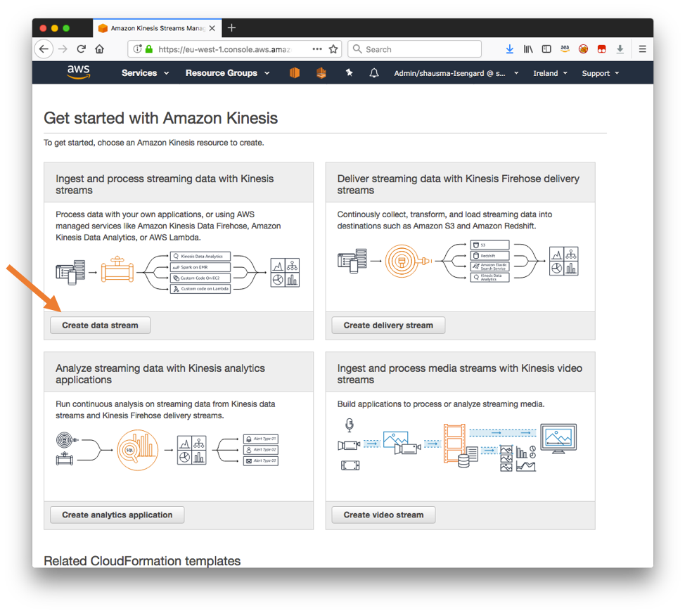

### 2.	When prompted, enter a unique name for the Kinesis data stream, eg, initials-taxi-trips, as Kinesis stream name. Enter 6 as the Number of shards and select Create Kinesis stream at the bottom of the page. 

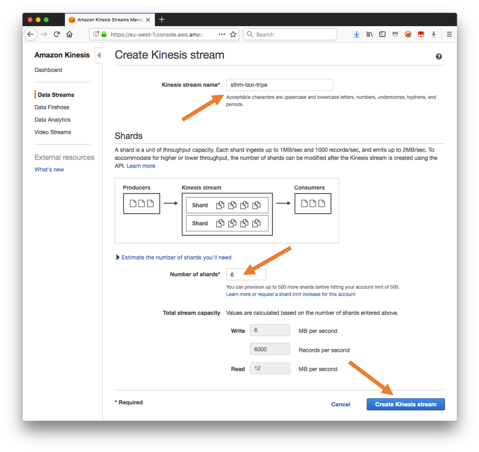

Now that the Kinesis data stream has been created, we want to ingest historic taxi trip events into the data stream. To this end, we will launch a CloudFormation template that compiles a kinesis replay Java application and loads it onto an EC2 instance.  First, we will need to have an EC2 SSH Key Pair as the CloudFormation template will need that.


### 1.	Navigate to the EC2 service and choose Key Pairs in the navigation bar on the left. 

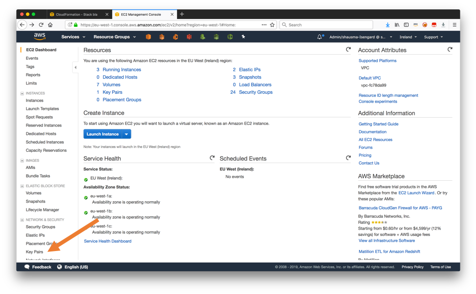

### 2.	Click Create Key Pair and enter a name for the SSH key pair in the resulting dialog box, eg, initals-key-pair and select Create. 

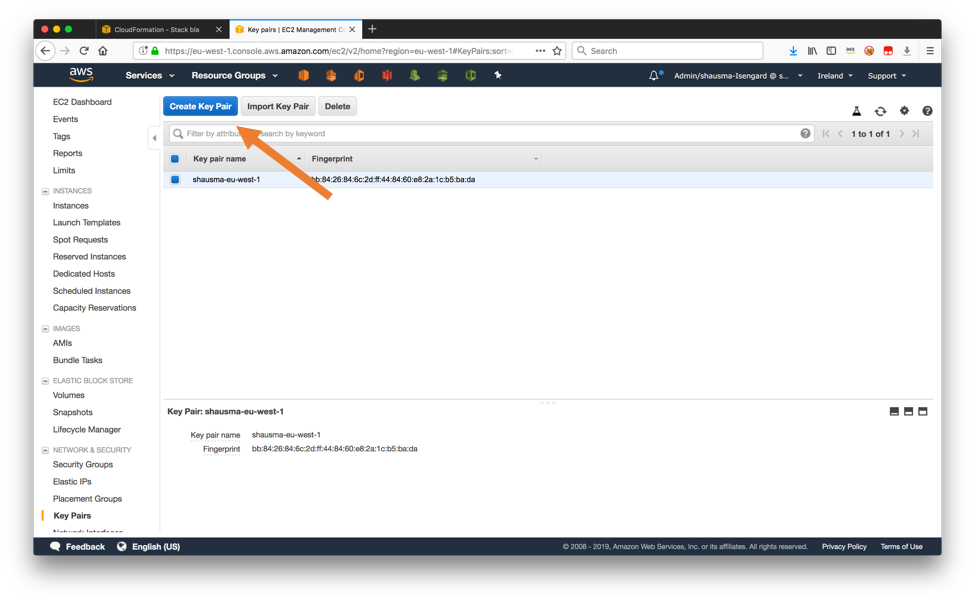

### 3.	Confirm the download of the generated .pem file to your local machine.

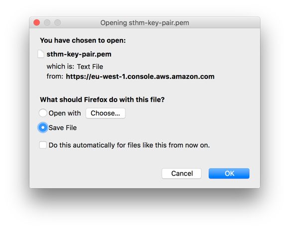

Now that you have successfully created an SSH key pair, you can create the EC2 instance that you will use to ingest taxi trip events into the previously created Kinesis data stream.

### 1.	Right-click on this [link](https://console.aws.amazon.com/cloudformation/home#/stacks/new?stackName=kinesis-replay-infrastructure&templateURL=https://dave-kinesis-lab.s3.amazonaws.com/kinesis-replay-infrastructure.yml) and open it in a new tab to execute a CloudFormation template that uses CodePipeline and CodeBuild to compile the kinesis replay Java application and to provision a EC2 instance. Select Next on the resulting dialog. 

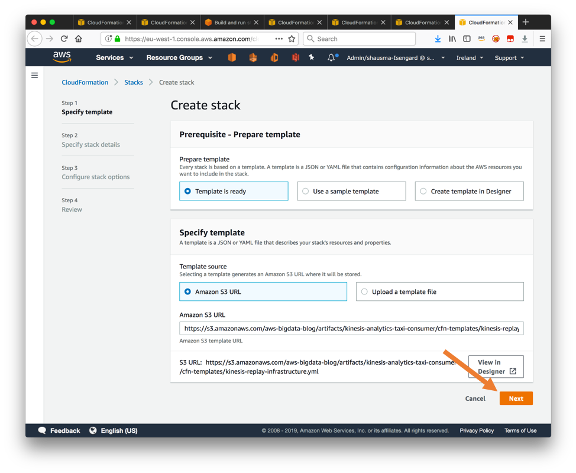

### 2.	On the next page of the dialog, specify an appropriate CIDR range to that is able to connect to the EC2 instance over SSH as the ClientIpAddressRange parameter. Moreover, select the previously created SSH key pair from the SshKeyName dropdown menu.

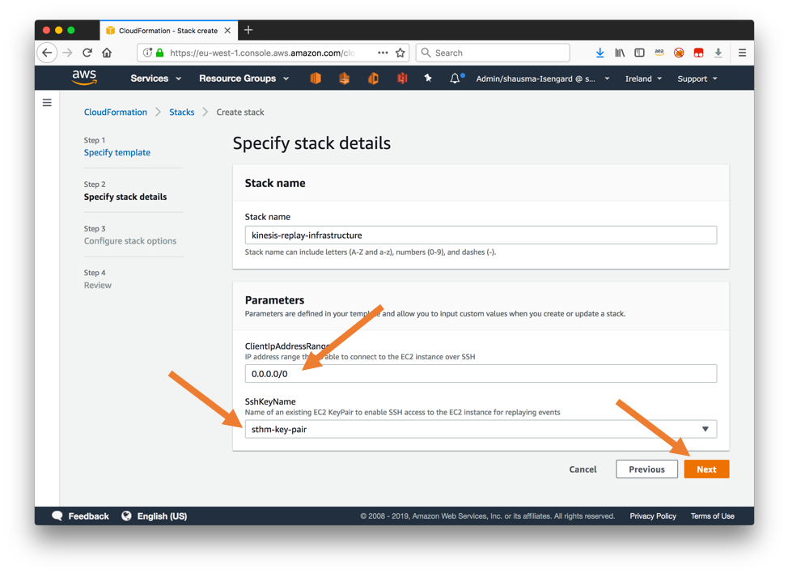

### 3.	On the next dialog for Step 3, leave all parameters set to their default and select Next. 

### 4.	On the last page of the dialog, confirm that CloudFormation may create IAM resource and create nested CloudFormation stacks by selecting the checkbox "I acknowledge that AWS CloudFormation might create IAM resources" and "I acknowledge that AWS CloudFormation might require the following capability: CAPABILITY_AUTO_EXPAND". Finally select Create stack at the bottom of the page.

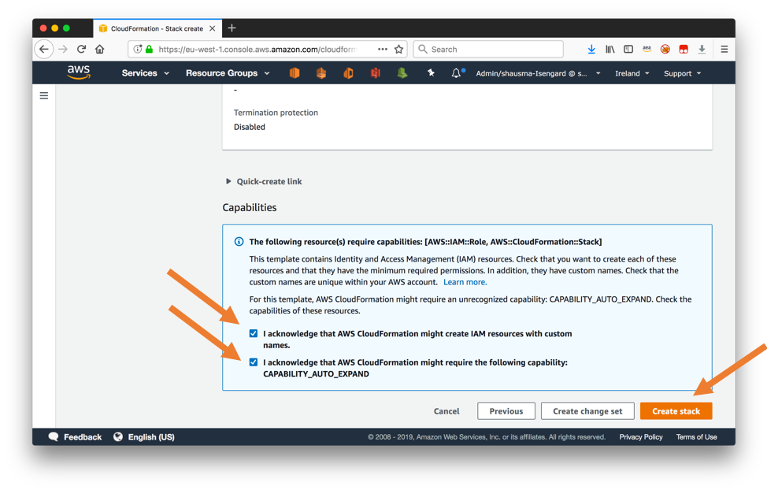

### 5.	Wait until the CloudFormation template has been successfully been created. This may take around 5 minutes.

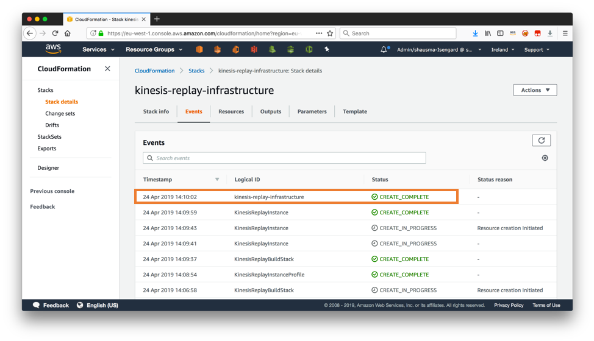

### 6.	Navigate to the Outputs section of the CloudFormation template and take a note of the outputs for KinesisReplayInstance and ProducerCommand.

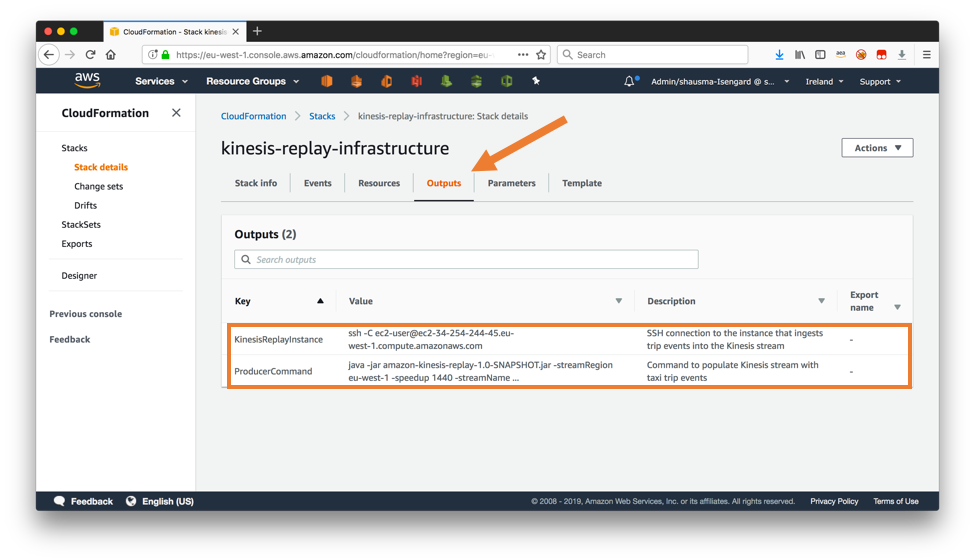

The CloudFormation template has created and configured an EC2 instance so that we can now start to ingest taxi trip events into the Kinesis data stream.

### 1.	Connect to the EC2 instance via SSH from your laptop. You can obtain the command including the correct parameters from the Outputs section of the CloudFromation template.  

Note: you will need to add "-i keyname.pem" and point to your downloaded ec2 ssh keypair file (your filename probably will be different than keyname.pem).
Note: you will likely also need to do a "chmod 0600 keyname.pem" on your ssh keypair file to set the right permissions.

Use the command from the Outputs section, but it should look somewhat like this:
```
# DO NOT COPY AND PASTE THIS COMMAND.
# THIS IS JUST AN EXAMPLE
# USE THE OUTPUT FROM YOUR CLOUDFORMATION TEMPLATE.
# YOU WILL NEED TO EDIT THE keyname.pem file/location.
$ chmod 0600 keyname.pem
$ ssh -i keyname.pem -C ec2-user@ec2-34-254-244-45.us-east-1.compute.amazonaws.com
```
 
Note for Windows users: Instead of the above command, you will need to follow these [instructions](https://docs.aws.amazon.com/AWSEC2/latest/UserGuide/putty.html) to use PuTTY to connect to the EC2 instance.


### 2.	Once the connection has been established, start ingesting events into the Kinesis data stream by executing the jar file that has already been downloaded to the Ec2 instance.  You will need to fill in the name of Kinesis data stream you have created earlier as the streamName parameter.

Use the command from the Outputs section, but it should look somewhat like this:
```
# DO NOT COPY AND PASTE THIS COMMAND.
# THIS IS JUST AN EXAMPLE
# USE THE OUTPUT FROM YOUR CLOUDFORMATION TEMPLATE.
# AND YOU WILL NEED TO MODIFY THE intials PART OF initials-taxi-trip
$ java -jar amazon-kinesis-replay-1.0-SNAPSHOT.jar -streamRegion us-east-1 -speedup 1440 -streamName initials-taxi-trips
```

Note: The almost correct command is again available from the Outputs section of the CloudFormation template, but this time you need to fill in the name of Kinesis data stream you have created earlier as the streamName parameter.

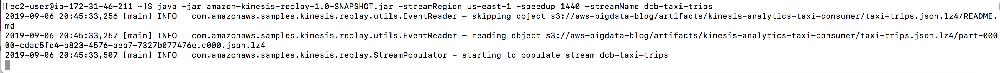

## Congratulations.  You have completed Immersion Day Lab1 - Ingestion into Kinesis Data Streams.