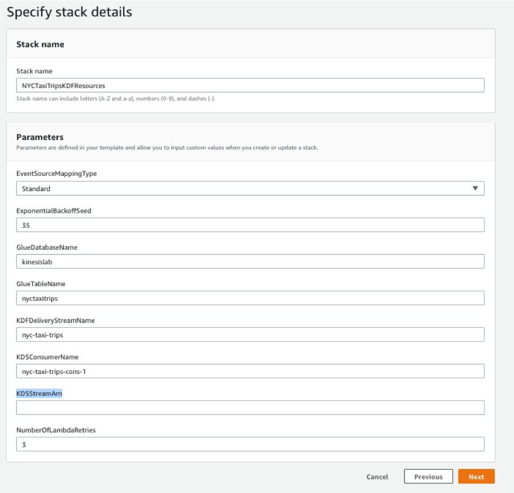
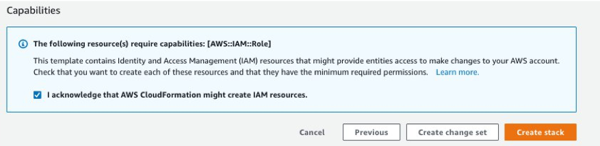
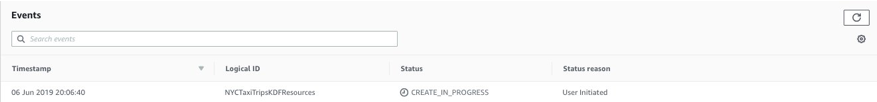
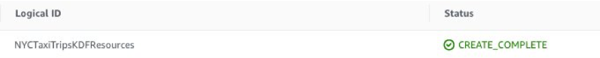

# Immersion Day Lab 2 - Process Data using a Lambda function and send to Kinesis Data Firehose

## Part 1 - Create resources using CloudFormation template

* Follow [this link](https://console.aws.amazon.com/cloudformation/home#/stacks/new?stackName=NYCTaxiTripsKDFResources&templateURL=https://s3.amazonaws.com/shausma-public/public/cfn-templates/kinesis-analytics-workshop/kinesis-firehose-infrastructure.yml) to execute the CloudFormation template.

* Click “Next” on the first screen.

* In the next screen, copy the Stream arn of the Kinesis Data Stream "initials-taxi-trips" from Lab1 and paste it in the “KDSStreamArn” box. Accept all other defaults and click “Next”

* Click “Next” on the next screen.

* In the next screen, scroll down and click on the checkbox in the “Capabilities” section and click “Create stack”

* Wait for the stack to get created.  

* While the Cloud Formation stack is creating, you should read through the steps in the [AWS Console UI](Part1UI.md) instructions to have a better idea of what the Cloud Formation template is doing behind the scenes.

Once the stack creation is complete, look into the resources and the outputs tab, and go to the respective consoles and explore the code, configuration and resources created.

## Congratulations- You have finished Part1 of this Lab.  You can now proceed to [Part2](Part2.md)

