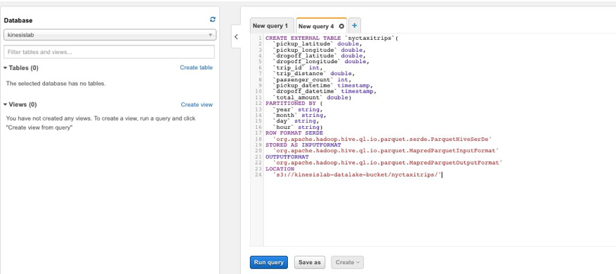

# Immersion Day Lab 2 - Process Data using a Lambda function and send to Kinesis Data Firehose

## Part 1 - Create resources using AWS CLI 

*NOTE: (Use this option only if you have a linux machine with AWS SDK installed and if you know how to use AWS profiles)*

Before we create the Kinesis Data Firehose delivery stream, lets fulfill following prerequisites that the firehouse delivery stream will need. 

### Create the S3 bucket:

* Run this command:

```
# CHANGE yourname_or_id BEFORE RUNNING

aws s3 mb s3://kinesislab-datalake-bucket-yourname_or_id --region us-east-1

```

### Create the Glue database:

* Run this command:

```
aws glue create-database --database-input '{"Name": "kinesislab"}' 

```

### Create the external table that Kinesis Data Firehose will use as a schema for data format conversion

* Go to the Athena console, in the left pane, under "Database", click on the dropdown and select the database that you created earlier through the Glue console. Paste the following sql statement in the query window and click on "Run query". Remember to replace the S3 bucket name with the name of the bucket you created above.


```
/* BE SURE TO EDIT THE LOCATION (LAST LINE) WITH THE NAME OF YOUR S3 BUCKET */

CREATE EXTERNAL TABLE `nyctaxitrips`(
  `pickup_latitude` double, 
  `pickup_longitude` double, 
  `dropoff_latitude` double, 
  `dropoff_longitude` double, 
  `trip_id` bigint, 
  `trip_distance` double, 
  `passenger_count` int, 
  `pickup_datetime` timestamp, 
  `dropoff_datetime` timestamp, 
  `total_amount` double)
 PARTITIONED BY ( 
  `year` string, 
  `month` string, 
  `day` string, 
  `hour` string)
 ROW FORMAT SERDE 
  'org.apache.hadoop.hive.ql.io.parquet.serde.ParquetHiveSerDe' 
 STORED AS INPUTFORMAT 
  'org.apache.hadoop.hive.ql.io.parquet.MapredParquetInputFormat' 
 OUTPUTFORMAT 
  'org.apache.hadoop.hive.ql.io.parquet.MapredParquetOutputFormat'
 LOCATION
  's3://kinesislab-datalake-bucket/nyctaxitrips/'

```



### Create Kinesis Data Firehose Delivery Stream

* Copy and paste the json below into a file called "createdeliverystream.json".  Note: you will need to make a few edits.

Replace the < account-id-no-hyphen > with your accountID.  Replace the < yourname or id > based on what you used to name your S3 bucket.

```
{
    "DeliveryStreamName": "nyc-taxi-trips",
    "DeliveryStreamType": "DirectPut",
    "ExtendedS3DestinationConfiguration": {
        "RoleARN": "arn:aws:iam:: <account-id-no-hyphen>:role/firehose_delivery_role",
        "BucketARN": "arn:aws:s3:::kinesislab-datalake-bucket-<yourname or id>",
        "Prefix": "nyctaxitrips/year=!{timestamp:YYYY}/month=!{timestamp:MM}/day=!{timestamp:dd}/hour=!{timestamp:HH}/",
        "ErrorOutputPrefix": "nyctaxitripserror/!{firehose:error-output-type}/year=!{timestamp:YYYY}/month=!{timestamp:MM}/day=!{timestamp:dd}/hour=!{timestamp:HH}/",
        "BufferingHints": {
            "SizeInMBs": 128,
            "IntervalInSeconds": 300
        },
        "CompressionFormat": "UNCOMPRESSED",
        "EncryptionConfiguration": {
            "NoEncryptionConfig": "NoEncryption"
        },
        "CloudWatchLoggingOptions": {
            "Enabled": true,
            "LogGroupName": "KDF-NYCTaxiTrips",
            "LogStreamName": "S3Delivery"
        },
        "S3BackupMode": "Disabled",
        "DataFormatConversionConfiguration": {
            "SchemaConfiguration": {
                "RoleARN": "arn:aws:iam::<account-id-no-hyphen>:role/firehose_delivery_role",
                "DatabaseName": "kinesislab",
                "TableName": "nyctaxitrips",
                "Region": "us-east-1",
                "VersionId": "LATEST"
            },
            "InputFormatConfiguration": {
                "Deserializer": {
                    "OpenXJsonSerDe": {}
                }
            },
            "OutputFormatConfiguration": {
                "Serializer": {
                    "ParquetSerDe": {}
                }
            },
            "Enabled": true
        }
    }
}
```

* Run this command:

```
aws firehose create-delivery-stream --cli-input-json file://createdeliverystream.json 

```

### Create the IAM role to use with the Lambda function
 
* Create a json file named TrustPolicyForLambda.json with the below contents

```
{
    "Version": "2012-10-17",
    "Statement": [{
        "Effect": "Allow",
        "Principal": {
            "Service": "lambda.amazonaws.com"
        },
        "Action": "sts:AssumeRole"
    }]
}

```

* Create a json file named KinesisPolicy.json with the below contents. You will need to make a few edits.

Note: Replace the < ACCOUNT_ID > with your account id.


```
{
    "Version": "2012-10-17",
    "Statement": [
        {
            "Action": [
                "kinesis:GetShardIterator",
                "kinesis:GetRecords",
                "firehose:PutRecordBatch",
                "kinesis:DescribeStream",
                "kinesis:ListShards"
            ],
            "Resource": [
                "arn:aws:firehose:us-east-1:<ACCOUNT_ID>:deliverystream/nyc-taxi-trips",
                "arn:aws:kinesis:us-east-1:<ACCOUNT_ID>:stream/initials-taxi-trips"
            ],
            "Effect": "Allow",
            "Sid": "KinesisPerm1"
        },
        {
            "Action": [
                "kinesis:ListStreams",
                "kinesis:SubscribeToShard",
                "kinesis:DescribeStreamSummary",
                "firehose:ListDeliveryStreams",
                "cloudwatch:*",
                "logs:*"
            ],
            "Resource": "*",
            "Effect": "Allow",
            "Sid": "KinesisPerm2"
        }
    ]
}

```

* Run the following commands:

```
aws iam create-role --role-name NYCTaxiTripsLambdaRole --assume-role-policy-document file://TrustPolicyForLambda.json
aws iam attach-role-policy --policy-arn arn:aws:iam::aws:policy/service-role/AWSLambdaBasicExecutionRole --role-name NYCTaxiTripsLambdaRole 
aws iam put-role-policy --role-name NYCTaxiTripsLambdaRole  --policy-name NYCTaxiTripsKinesisPolicy --policy-document file://KinesisPolicy.json

```

### Create the Lambda function to process records from the Kinesis Data Stream

* Run this command to create Enhanced Fanout consumer for your Kinesis nyc-taxi-trips stream: 

```
# You need to edit this command and use your-kinesis-stream-arn
aws kinesis register-stream-consumer --stream-arn your-kinesis-stream-arn --consumer-name nyc-taxi-trips-cons-1

```

* •	Save the Lambda function code below in a “lambda_function.py” file 

```
import base64
from datetime import datetime
import time
import json
import boto3
import random  
import uuid
import os

client = boto3.client('firehose')


def check_data(data):
    payload = json.loads(data)

    if payload['type'] == "trip" and payload['pickup_longitude'] != 0 and payload['pickup_latitude'] != 0 and payload['dropoff_latitude'] != 0 and payload['dropoff_longitude'] != 0:
        return True
    else:
        return False
        
def gen_retry_output_list(resp, outputRecList):
    recCount = 0
    retryOutputList = []
    for respRec in resp['RequestResponses']:
        try:
            respError = respRec['ErrorCode']
            if respError == "ServiceUnavailableException":
                retryOutputList.append(outputRecList[recCount])
        except KeyError:
            pass
        recCount += 1
    
    return retryOutputList
    
def get_sleep_time(retryCount, exponentialBackoff, seed):

    if (exponentialBackoff == True):
        return (2*(seed**retryCount))/1000
    else:
        return (500/1000)
 
def lambda_handler(event, context):
    print('Loading function' + ' ' +  datetime.now().strftime('%Y-%m-%dT%H:%M:%S.%fZ'))
    print('Processing {} record(s).'.format(len(event['Records'])))
    output = {}
    outputRecList = []
    retryOutputList = []
    numRetries = int(os.environ['number_of_retries'])
    retryCount = 1
    eventRecords = len(event['Records'])
    tripIds = []
    deliveryStreamName = os.environ['delivery_stream_name']
    seed = int(os.environ['exponential_backoff_seed'])
    exponentialBackoff = False
    
    for record in event['Records']:
        recordData = base64.b64decode(record['kinesis']['data'])  
        recordDataJson = json.loads(recordData)
        if check_data(recordData):
            output['Data'] = recordData
            outputRecList.append(output)
            output = {}
            tripIds.append(recordDataJson['trip_id'])
            
    if len(outputRecList) > 0:
        
        resp = client.put_record_batch(DeliveryStreamName=deliveryStreamName,
                   Records=outputRecList
            )
    else:
        print("No records to send ...")
        return {
            'statusCode': 200,
            'body': json.dumps('Lambda successful!')
        }
        
    
    if resp['FailedPutCount'] != 0:
        print('Failed to process {} record(s).'.format(resp['FailedPutCount']))
        
        if resp['FailedPutCount'] != eventRecords:
            
            while (retryCount <= numRetries):
                
                print("Retrying {} failed records up to {} times with exponential backoff...".format(resp['FailedPutCount'], numRetries - (retryCount - 1)))
                retryOutputList = gen_retry_output_list(resp, outputRecList)
                if len(retryOutputList) > 0:
                    exponentialBackoff = True
                print("Backing Off for {} seconds ...".format(get_sleep_time(retryCount, exponentialBackoff, seed)))
                time.sleep(get_sleep_time(retryCount, exponentialBackoff, seed))
                
                retryResp = client.put_record_batch(DeliveryStreamName=deliveryStreamName,
                    Records=retryOutputList
                ) 
    
                if retryResp['FailedPutCount'] == 0:
                    print("Retry successful after {} tries ...".format(retryCount))
    
                    return {
                            'statusCode': 200,
                            'body': json.dumps('Lambda successful!')
                    }
                        
                retryCount += 1
                outputRecList = retryOutputList
                retryOutputList = []
                resp = retryResp
                print(resp['RequestResponses'])

            print("All retries unsuccessful. Letting Lambda retry but there could be duplicates ...")
            raise Exception("Records could not be sent. Lambda to retry ...")
        else:
            print("Since all records failed, letting Lambda retry..")
            print(tripIds)
            print(resp['RequestResponses'])
            raise Exception("Records could not be sent. Lambda to retry ...")
    else:
         print("Records successfully sent ...")
         return {
            'statusCode': 200,
            'body': json.dumps('Lambda successful!')
        }

```

* Create a lambda deployment package for the python code created by running the command below:

```
zip lambda_function.zip lambda_function.py

```

* Run this command to create the Lambda function:

```
# EDIT THE FOLLOWING COMMAND TO REPLACE account-id WITH YOUR REAL ACCOUNTID
aws lambda create-function --function-name NYCTaxiTrips --runtime python3.7 --role arn:aws:iam::account-id:role/NYCTaxiTripsLambdaRole --handler lambda_function.lambda_handler --zip-file "fileb://lambda_function.zip"

```

#### Lambda configuration as a consumer for Kinesis Stream

Tto illustrate the differences, we provide instructions to configue the Lambda trigger in standard (polling) and Enhanced FanOut mode.  You need to choose and run the step for at least one of these configurations.

* For standard event source mapping, run this:

```
# EDIT THE FOLLOWING COMMAND TO REPLACE Kinesis-stream-arn WITH ARN OF YOUR STREAM ARN
aws lambda create-event-source-mapping --event-source-arn Kinesis-stream-arn --function-name NYCTaxiTrips --starting-position LATEST

```

Hint: To get the stream-arn use command below or AWS console: 

```
# EDIT THE FOLLOWING COMMAND TO REPLACE initials-taxi-trips WITH NAME OF STREAM FROM LAB1
aws kinesis describe-stream --stream-name initials-taxi-trips 

```

* For EnhancedFanOut event source mapping, run this:

```
# EDIT THE FOLLOWING COMMAND TO REPLACE consumer-arn-for-Fanout WITH ARN OF ENHANCEDFANOUT CONSUMER
aws lambda create-event-source-mapping --event-source-arn consumer-arn-for-Fanout --function-name NYCTaxiTrips --starting-position LATEST

```

Hint: to get the consumer-arn use: 

```
# EDIT THE FOLLOWING COMMAND TO REPLACE Kinesis-stream-arn WITH ARN OF YOUR STREAM ARN
aws kinesis list-stream-consumers --stream-arn Kinesis-stream-arn

```

The Lambda function that will process the records from the Kinesis Data stream is now created and the event source mapping is also created.

## Congratulations- You have finished Part1 of this Lab.  You can now proceed to [Part2](Part2.md)


