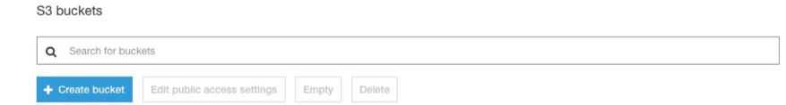
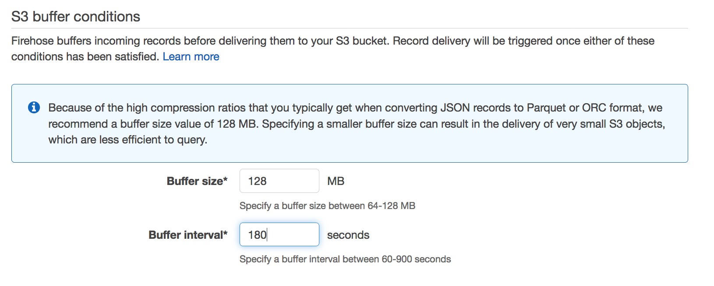
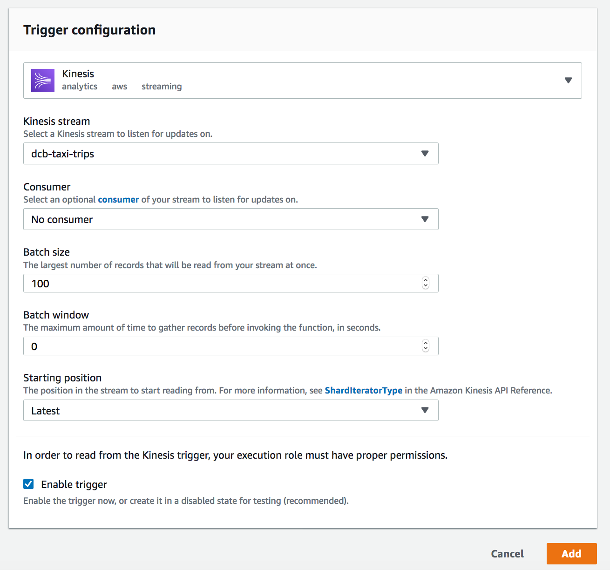

# Immersion Day Lab 2 - Process Data using a Lambda function and send to Kinesis Data Firehose

## Part 1 - Create resources using AWS Console

Before we create the Kinesis Data Firehose delivery stream, lets fulfill following prerequisites that the firehouse delivery stream will need. 

### Create the Glue database:

* Go to the Glue console, click on "Databases" in the left pane and then click on "Add database". 


* Type in a name for the database and click on "Create". This database will be used later to create an external table using the Athena console to provide a schema for data format conversion when creating a delivery stream using the Kinesis Data Firehose console.


### Create the S3 bucket:

* Go to the S3 console, click on "Create bucket". This bucket will be used to store the data delivered to S3 via the Kinesis Data Firehose delivery stream.



* Type in the Bucket name, specify the Region and click on "Create".


### Create the external table that Kinesis Data Firehose will use as a schema for data format conversion

* Go to the Athena console, in the left pane, under "Database", click on the dropdown and select the database that you created earlier through the Glue console. Paste the following sql statement in the query window and click on "Run query". Remember to replace the S3 bucket name with the name of the bucket you created earlier through the S3 console.

```
/* BE SURE TO EDIT THE LOCATION (LAST LINE) WITH THE NAME OF YOUR S3 BUCKET */

CREATE EXTERNAL TABLE `nyctaxitrips`(
  `pickup_latitude` double, 
  `pickup_longitude` double, 
  `dropoff_latitude` double, 
  `dropoff_longitude` double, 
  `trip_id` bigint, 
  `trip_distance` double, 
  `passenger_count` int, 
  `pickup_datetime` timestamp, 
  `dropoff_datetime` timestamp, 
  `total_amount` double)
 PARTITIONED BY ( 
  `year` string, 
  `month` string, 
  `day` string, 
  `hour` string)
 ROW FORMAT SERDE 
  'org.apache.hadoop.hive.ql.io.parquet.serde.ParquetHiveSerDe' 
 STORED AS INPUTFORMAT 
  'org.apache.hadoop.hive.ql.io.parquet.MapredParquetInputFormat' 
 OUTPUTFORMAT 
  'org.apache.hadoop.hive.ql.io.parquet.MapredParquetOutputFormat'
 LOCATION
  's3://kinesislab-datalake-bucket/nyctaxitrips/'

```


### Create Kinesis Data Firehose Delivery Stream:

* Navigate to the Amazon Kinesis services and press Get Started when prompted (you may not need to complete this, if you have already used Amazon Kinesis). Select Create delivery stream to navigate to the Amazon Kinesis Data Firehose service


* Enter a unique name for the Delivery stream name, eg, nyc-taxi-trips. For “Source”, choose “Direct PUT or other sources” as a lambda function would be used to feed events to the Kinesis Data Firehose delivery stream. Click Next.


* Choose “Record Transformation” “as “Disabled” and “Record format conversion” as “Enabled” and choose “Output format” as “Apache Parquet”.


* Choose the schema to use for data format conversion as illustrated in the screenshot below.


* Select the S3 destination. I chose "S3".


* Click on the dropdown next to "S3 bucket" and select the bucket that you created earlier through the S3 console. For "S3 prefix", copy and paste the following:

```
nyctaxitrips/year=!{timestamp:YYYY}/month=!{timestamp:MM}/day=!{timestamp:dd}/hour=!{timestamp:HH}/ 
```

* For "S3 error prefix" copy and paste the following:

```
nyctaxitripserror/!{firehose:error-output-type}/year=!{timestamp:YYYY}/month=!{timestamp:MM}/day=!{timestamp:dd}/hour=!{timestamp:HH}/
```

* For "Source record S3 backup", click on "Disabled". Click on "Next".


* Specify the buffering hints for the Amazon S3 destination. Type in 128 MB and 300 seconds.



* Keep the default settings for "S3 compression and encryption".


* Choose "Enabled" for "Error logging".


* Specify the IAM role that you want Kinesis Data Firehose to assume to access resources on your behalf. Choose either Create new or Choose to display a new screen. 


* Choose Create a new IAM role, name the role, and then choose Allow.


* Choose Create Delivery Stream.

### Create the IAM role to use with the Lambda function

* Go to the IAM console, click on "Roles" and the click "Create role". Click on "AWS service" and then click on "Lambda". Change the name of the Kinesis Data Stream if you created a stream named different than “nyc-taxi-trips”.


* Click on "Next:Permissions"

* In the search box next to "Filter policies", type "AWSLambdaBasicExecutionRole" and select the checkbox next to "AWSLambdaBasicExecutionRole". 


* Click on "Next:Tags" and add tags if you wish. Click "Next:Review"

* Fill in the details as show below and click on "Create role".


* Click on the newly create role. Then click on "Add inline policy". Click on the "JSON" tab. Then copy and paste the json from below (remember to change the account-id to your account id and the stream name and delivery stream name to your streams). Then click on "Review policy".

```
{
    "Version": "2012-10-17",
    "Statement": [{
            "Sid": "Effect",
            "Effect": "Allow",
            "Action": [
                "kinesis:GetShardIterator",
                "kinesis:GetRecords",
                "firehose:PutRecordBatch",
                "kinesis:DescribeStream"
            ],
            "Resource": [
                "arn:aws:kinesis:us-east-1:<accountid>:stream/nyc-taxi-trips",
                "arn:aws:firehose:us-east-1:<accountid>:deliverystream/nyc-taxi-trips"
            ]
        },
        {
            "Sid": "KinesisPerm2",
            "Effect": "Allow",
            "Action": [
                "kinesis:ListStreams",
                "kinesis:SubscribeToShard",
                "kinesis:DescribeStreamSummary",
                "firehose:ListDeliveryStreams"
            ],
            "Resource": "*"
        },
        {
            "Sid": "KinesisPerm3",
            "Effect": "Allow",
            "Action": "kinesis:ListShards",
            "Resource": [
                "arn:aws:kinesis:us-east-1:<accountid>:stream/nyc-taxi-trips"
            ]
        }
    ]
}

```

* Fill in the details as shown below and click on "Create policy".


The Lambda role is now created.

### Create the Lambda function to process records from the Kinesis Data Stream

The Lambda function does a few things:
1.	It inspects the incoming message for unclean records with missing fields and filters them out.
2.	It tries to send the clean records to Kinesis Data Firehose.
3.	If it receives a throttling error, it determines if all the records received failed or some records failed.
a.	If all records failed, it raises an exception, so the Lambda service can retry with the same payload (the service keeps retrying with the same payload until it receives a success). It also logs the corresponding trip ids so you can check to see if they actually made it through to the S3 bucket.
b.	If some records failed, it retries based on the configured retries environment variable with exponential backoff. If any of the retries are successful, it returns a success. If none of the retries are successful, it raises an exception so the Lambda service can retry with the same payload. Note that in this case, there could be duplicate records sent. You can increase the number of retries or save the records somewhere to process later and move on as alternate strategies to prevent duplicates.

* Go to the Lambda console and click on "Create function". 

* Select "Author from scratch" and fill in the details as show below and click on "Create function".


* Copy and Paste the following code in the "Function code" window overwriting the template code. Then click "Save".

```
import base64
from datetime import datetime
import time
import json
import boto3
import random  
import uuid
import os

client = boto3.client('firehose')


def check_data(data):
    payload = json.loads(data)

    if payload['type'] == "trip" and payload['pickup_longitude'] != 0 and payload['pickup_latitude'] != 0 and payload['dropoff_latitude'] != 0 and payload['dropoff_longitude'] != 0:
        return True
    else:
        return False
        
def gen_retry_output_list(resp, outputRecList):
    recCount = 0
    retryOutputList = []
    for respRec in resp['RequestResponses']:
        try:
            respError = respRec['ErrorCode']
            if respError == "ServiceUnavailableException":
                retryOutputList.append(outputRecList[recCount])
        except KeyError:
            pass
        recCount += 1
    
    return retryOutputList
    
def get_sleep_time(retryCount, exponentialBackoff, seed):

    if (exponentialBackoff == True):
        return (2*(seed**retryCount))/1000
    else:
        return (500/1000)
 
def lambda_handler(event, context):
    print('Loading function' + ' ' +  datetime.now().strftime('%Y-%m-%dT%H:%M:%S.%fZ'))
    print('Processing {} record(s).'.format(len(event['Records'])))
    output = {}
    outputRecList = []
    retryOutputList = []
    numRetries = int(os.environ['number_of_retries'])
    retryCount = 1
    eventRecords = len(event['Records'])
    tripIds = []
    deliveryStreamName = os.environ['delivery_stream_name']
    seed = int(os.environ['exponential_backoff_seed'])
    exponentialBackoff = False
    
    for record in event['Records']:
        recordData = base64.b64decode(record['kinesis']['data'])  
        recordDataJson = json.loads(recordData)
        if check_data(recordData):
            output['Data'] = recordData
            outputRecList.append(output)
            output = {}
            tripIds.append(recordDataJson['trip_id'])
            
    if len(outputRecList) > 0:
        
        resp = client.put_record_batch(DeliveryStreamName=deliveryStreamName,
                   Records=outputRecList
            )
    else:
        print("No records to send ...")
        return {
            'statusCode': 200,
            'body': json.dumps('Lambda successful!')
        }
        
    
    if resp['FailedPutCount'] != 0:
        print('Failed to process {} record(s).'.format(resp['FailedPutCount']))
        
        if resp['FailedPutCount'] != eventRecords:
            
            while (retryCount <= numRetries):
                
                print("Retrying {} failed records up to {} times with exponential backoff...".format(resp['FailedPutCount'], numRetries - (retryCount - 1)))
                retryOutputList = gen_retry_output_list(resp, outputRecList)
                if len(retryOutputList) > 0:
                    exponentialBackoff = True
                print("Backing Off for {} seconds ...".format(get_sleep_time(retryCount, exponentialBackoff, seed)))
                time.sleep(get_sleep_time(retryCount, exponentialBackoff, seed))
                
                retryResp = client.put_record_batch(DeliveryStreamName=deliveryStreamName,
                    Records=retryOutputList
                ) 
    
                if retryResp['FailedPutCount'] == 0:
                    print("Retry successful after {} tries ...".format(retryCount))
    
                    return {
                            'statusCode': 200,
                            'body': json.dumps('Lambda successful!')
                    }
                        
                retryCount += 1
                outputRecList = retryOutputList
                retryOutputList = []
                resp = retryResp
                print(resp['RequestResponses'])

            print("All retries unsuccessful. Letting Lambda retry but there could be duplicates ...")
            raise Exception("Records could not be sent. Lambda to retry ...")
        else:
            print("Since all records failed, letting Lambda retry..")
            print(tripIds)
            print(resp['RequestResponses'])
            raise Exception("Records could not be sent. Lambda to retry ...")
    else:
         print("Records successfully sent ...")
         return {
            'statusCode': 200,
            'body': json.dumps('Lambda successful!')
        }

```

* Scroll down to the “Environment variables” section and fill it out as show below:


* Go to the Triggers pane in the top left of the page, scroll down and click on "Kinesis".


* Scroll down to the "Configure triggers" section and fill in the details as shown below. First we will setup the trigger in "Standard" mode which is with "No consumer". Click "Add". Then scroll up and click "Save".



## Congratulations- You have finished Part1 of this Lab.  You can now proceed to [Part2](Part2.md)


