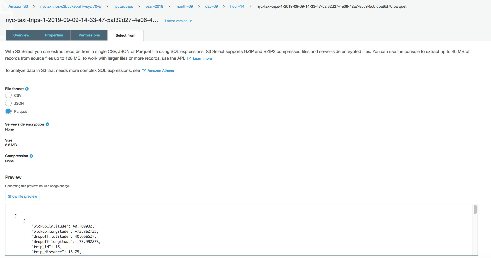
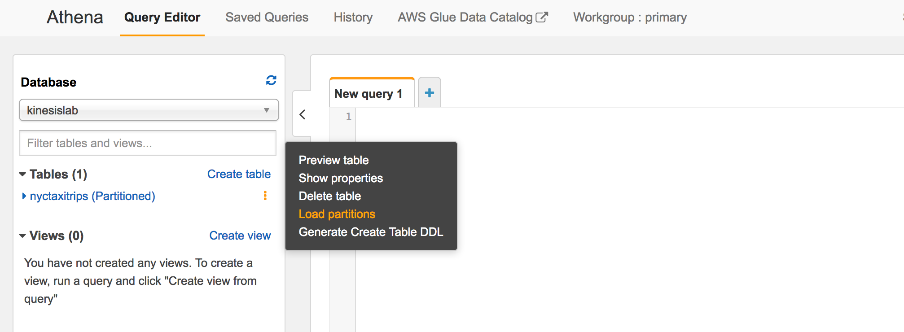
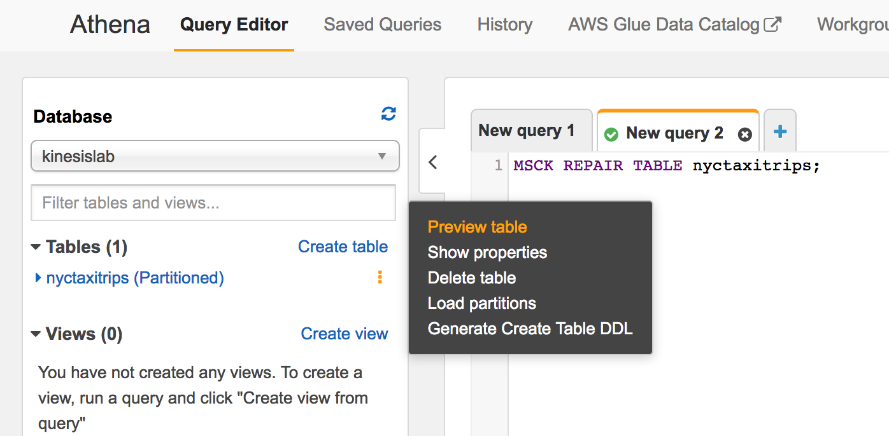
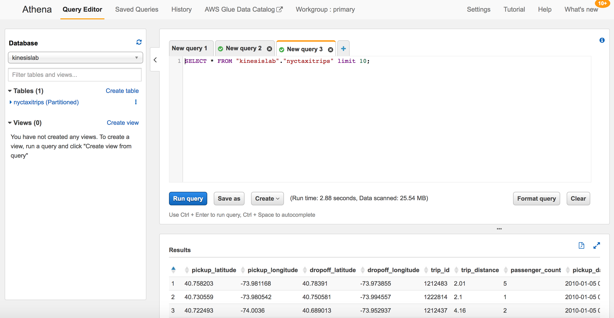

# Immersion Day Lab 2 - Process Data using a Lambda function and send to Kinesis Data Firehose

## Part 2 - Stream the data and validate output

* Start sending data to the Kinesis Data stream created in Lab1 using the command below from your EC2 Bastian host if it is not already running.

```
# CHANGE initials-taxi-trips TO YOUR ACTUAL STREAM NAME FROM LAB1
java -jar amazon-kinesis-replay-1.0-SNAPSHOT.jar -streamRegion us-east-1 -speedup 1800 -streamName initials-taxi-trips 

```

Once the Lambda function starts processing (note that it will process from the tip of the stream as the starting position is set to LATEST), the Kinesis Data Firehose delivery stream you created will ingest the records, buffer it, transform it to parquet and deliver it to the S3 destination under the prefix provided. The buffer is set to 3 minutes or 128 MB, which ever happens first.  So, it may be 3 minutes before you see data in S3.

* Wait for a few minutes (see above paragraph)


### Navigate to the Kinesis Console and click on the "nyc-taxi-trips" Data Firehose delivery stream


### Click on the Monitoring tab and you should start to see some metrics from your Firehose delivery stream


### Click on the Details tab.  Scroll down to the Amazon S3 destination section.  Then click on the S3 bucket link.


If it has been 3 minutes, you should see some data in your S3 bucket.  If not, please wait a bit longer.


### Navigate into the "nyctaxitrips" folder and through the subfolders until you get to the data files in parquet format.


### Click on one of the parquet files.  Then choose the "Select from" tab.  Then click "Show file preview"



Observe that you are able to see your taxi trip data in the parquet file in S3.  Kinesis Data Firehouse has done its job.


### Now navigate to the Athena Console.  Select the kinesisdatalab database.  Then click on the vertical ... to the right of the nyctaxitrips table and choose "Load partitions"



### Now click on the vertical ... the the right of the nyctaxitrips table and choose "Preview table"



This will launch a simple SQL query, which when finished will look like:



Note: if you do not see data, please re-run the "Load partitions" step.

Observe that you are able to query your taxi trip data via SQL using Athena.


## Congratulations.  You have completed Immersion Day Lab2 - Process Data using a Lambda function and send to Kinesis Data Firehose


Click [here](../README.md) to return to Immersion Day table of contents.

