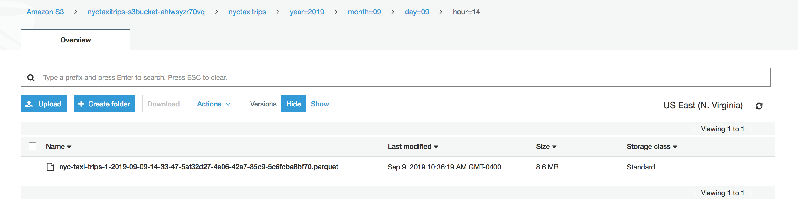

# Immersion Day Lab 2 - Process Data using a Lambda function and send to Kinesis Data Firehose

## Part 2 - Stream the data and validate output

* Start sending data to the Kinesis Data stream created in Lab1 using the command below from your EC2 Bastian host if it is not already running.

```
# CHANGE initials-taxi-trips TO YOUR ACTUAL STREAM NAME FROM LAB1
java -jar amazon-kinesis-replay-1.0-SNAPSHOT.jar -streamRegion us-east-1 -speedup 1800 -streamName initials-taxi-trips 

```

Once the Lambda function starts processing (note that it will process from the tip of the stream as the starting position is set to LATEST), the Kinesis Data Firehose delivery stream you created will ingest the records, buffer it, transform it to parquet and deliver it to the S3 destination under the prefix provided. The buffer is set to 3 minutes or 128 MB, which ever happens first.  So, it may be 3 minutes before you see data in S3.

* Wait for a few minutes (see above paragraph)


### Navigate to the Kinesis Console and click on the "nyc-taxi-trips" Data Firehose delivery stream


### Click on the Monitoring tab and you should start to see some metrics from your Firehose delivery stream


### Click on the Details tab.  Scroll down to the Amazon S3 destination section.  Then click on the S3 bucket link.


If it has been 5 minutes, you should see some data in your S3 bucket.  If not, please wait a bit longer.


### Navigate into the "nyctaxitrips" folder and through the subfolders until you get to the data files in parquet format.



### Go to the S3 console and navigate to the bucket and prefix and locate the files.


You can also navigate to Amazon Cloudwatch Logs to look at the output of the Kinesis Data Streams trigger Lambda function. To do that, go to the Lambda console, click on the function you created, click on the “Monitoring” tab, then click on “View logs in CloudWatch”. This should take you to the Cloudwatch Logs console and you can see the log streams. Click on any one of them and scroll down to observe the lambda function execution outputs. In particular, look for the instances of throttling errors received from Kinesis Data Firehose and how the function handles them.


Click [here](../README.md) to return to Immersion Day table of contents.

