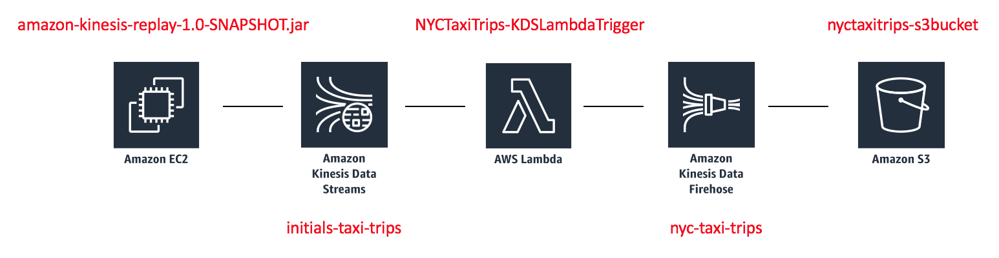

# Immersion Day Lab 2 - Process Data using a Lambda function and send to Kinesis Data Firehose

In this section, we create a Lambda function that reads from the Kinesis Delivery Stream created in Lab1.  We also create an Amazon Kinesis Data Firehose delivery stream to write to a S3 bucket.  Our Lambda function filters out the spurious data in the incoming events and then sends the clean events to our Firehose Delivery Stream in batch mode (using the PutRecordBatch API).

Amazon Kinesis Data Firehose is the easiest way to load streaming data into data stores and analytics tools. It can capture, transform, and load streaming data into Amazon S3, Amazon Redshift, Amazon Elasticsearch Service, and Splunk, enabling near real-time analytics with existing business intelligence tools and dashboards you’re already using today. It is a fully managed service that automatically scales to match the throughput of your data and requires no ongoing administration. It can also batch, compress, and encrypt the data before loading it, minimizing the amount of storage used at the destination and increasing security.

We configure our Kinesis Firehose delivary stream to write data to S3 using the parquet file format.  Parquet files have a defined schema, so as part of creating the resources for this lab we will define the schema for our taxi trips dataset using Glue/Athena (which also makes it easy to query the data once Firehouse delivers it to S3).
 
This lab covers 3 different ways to creating the resources for the above described functionality and you can choose the approach you want to use for the Part 1 of this lab.

|Approach |Description |
|---- | ----|
|[Cloud Formation](Part1CF.md) |Create resources using CloudFormation template (this is the easiest) |
|[AWS Console UI](Part1UI.md) |Create resources using AWS Console (next easiest.  good for understanding what's happening.) |
|[AWS CLI](Part1CLI.md) |Create resources using AWS CLI (Use this option only if you have a linux machine with AWS SDK installed and you know how to setup/use the AWS CLI) |

When done with creating resources, you will proceed to Part 2 of this Lab to stream data through the Lambda function and Kinesis Firehose and validate output.

*Hint: If in doubt, we suggest creating resources via the [Cloud Formation](Part1CF.md) approach.  While the Cloud Formation is running, you can review the steps in the [AWS Console UI](Part1UI.md) instructions to have a better idea of what the Cloud Formation template is doing behind the scenes.*

