# Kinesis Immersion Day Lab3 - Clean, Aggregate, and Enrich Events with Kinesis Data Analytics SQL

In the previous section, you’ve created a Kinesis data stream and started to ingest events into the data stream. In this section, you will learn how to connect Kinesis Data Analytics to your existing stream and clean, aggregate, and enrich the incoming events.

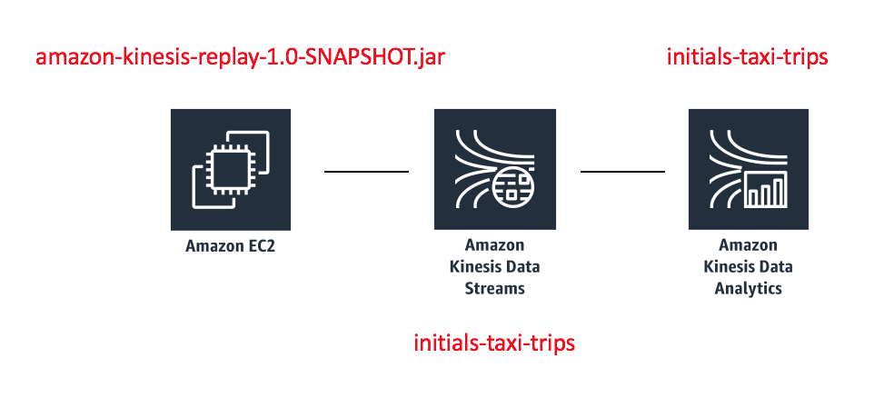

### 1.	Navigate to the Amazon Kinesis services and select Create analytics application to navigate to the Amazon Kinesis Data Stream service.

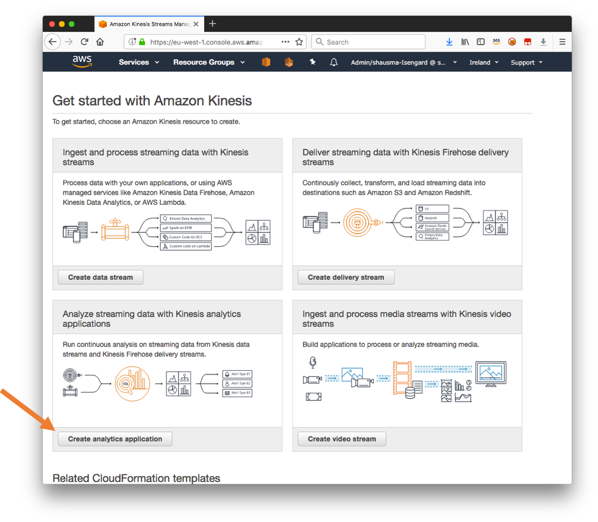


### 2.	Enter a name for the application as Application name, eg, initials-taxi-trips. Select SQL as the Runtime and hit the Create application button.

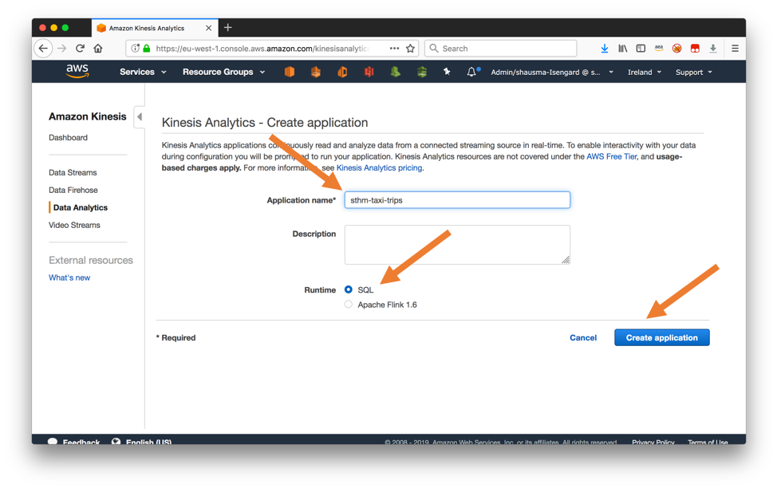

### 3.	Select Connect streaming data to connect the existing Kinesis data stream with your Kinesis Analytics application.

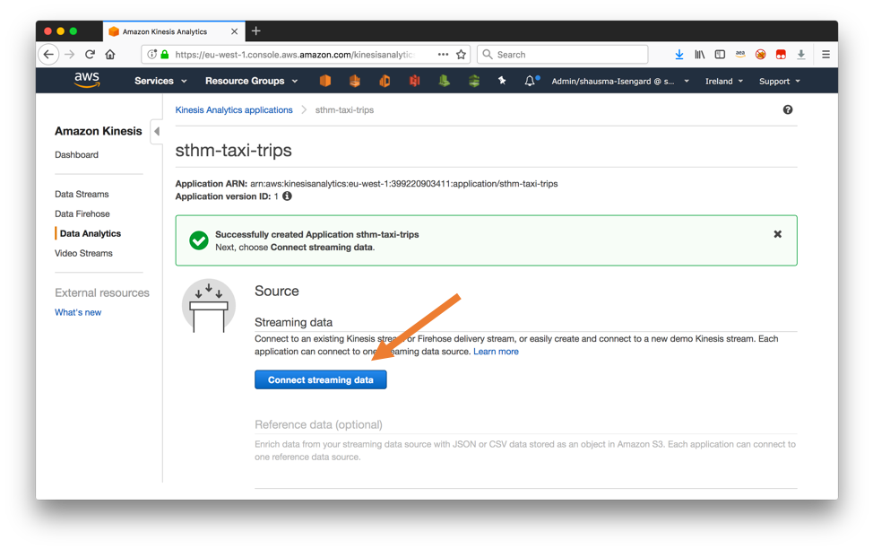

### 4.  Select Kinesis stream as the Source and choose the Kinesis data stream you have created earlier from the Kinesis stream dropdown menu.

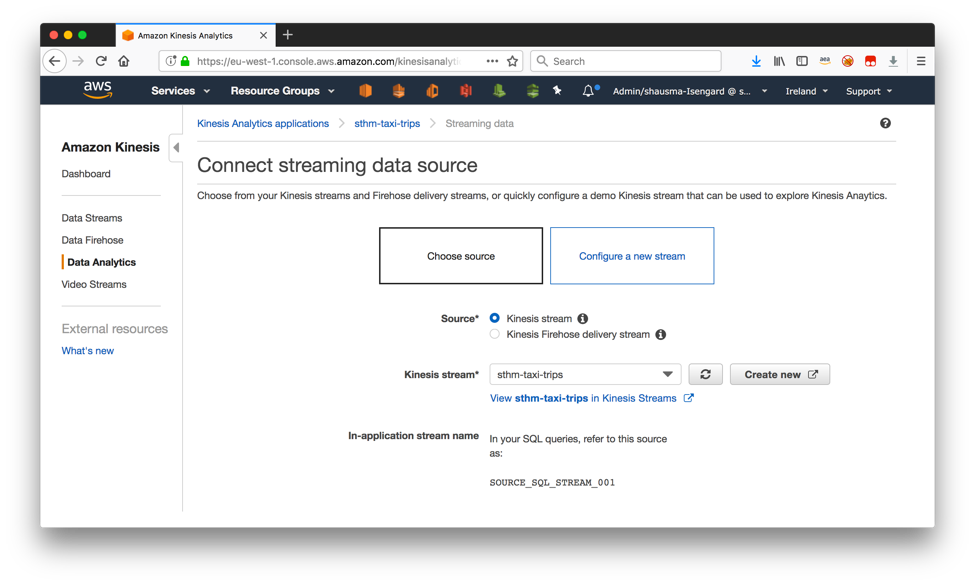

### 5.	Ensure that the replay Java application is still ingesting events into the Kinesis data stream and select Discover schema at the bottom of the same page.

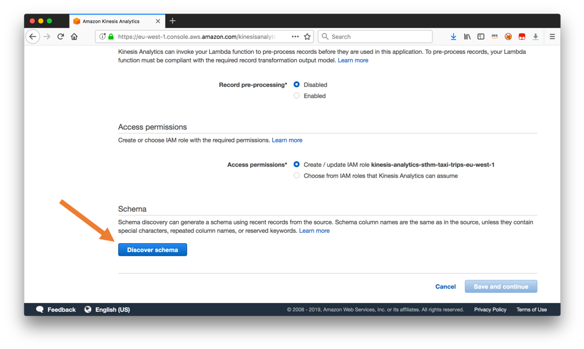

### 6.	After the schema discovery completed successfully, select Edit schema to fine tune the inferred schema.

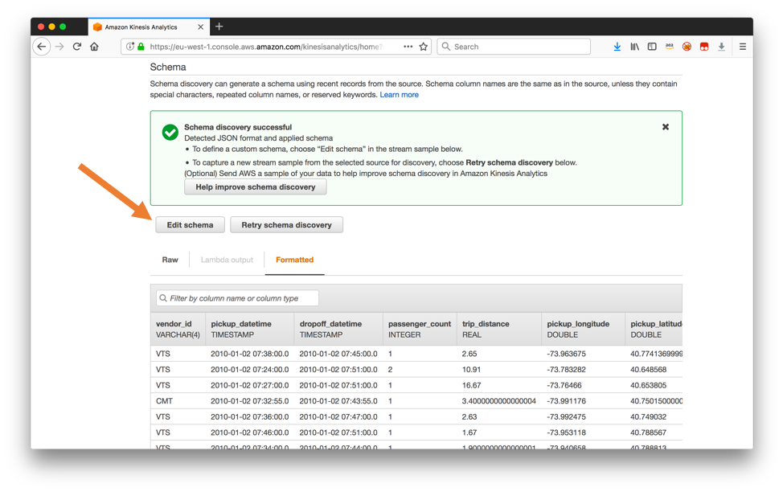

### 7.	In the dropdown menu for the type of the attribute trip_id, change the type from INT to BIGINT. Moreover, change the Length of the attribute type from 4 to 9. Complete this step by pressing Save schema and update stream samples. It may take a minute until the operation completes.

Note: If the type of trip_id is already BIGINT, then you can leave it as it is. If the length of the type attribute is already >=9, then you can leave the length as it is.


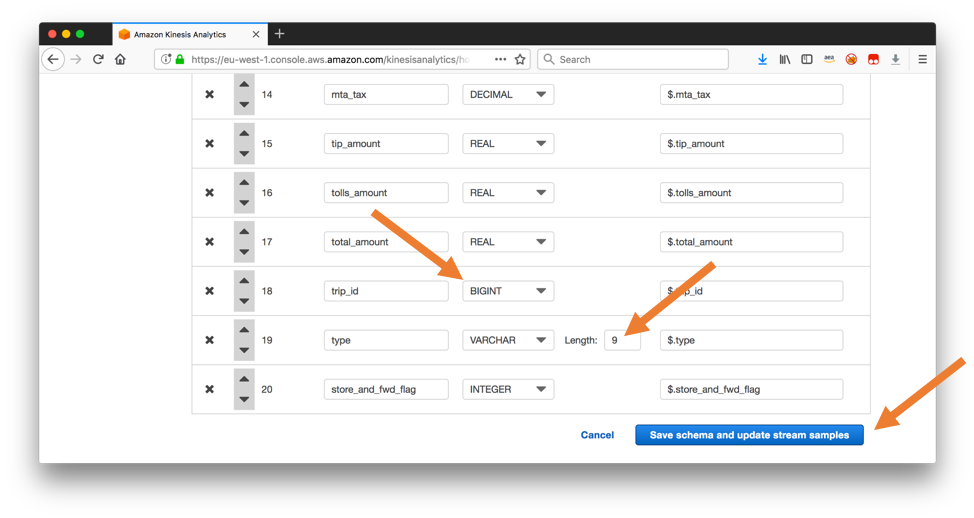

### 8.	Verify, that the incoming events are successfully mapped to the corrected schema and click on Exit (done). 

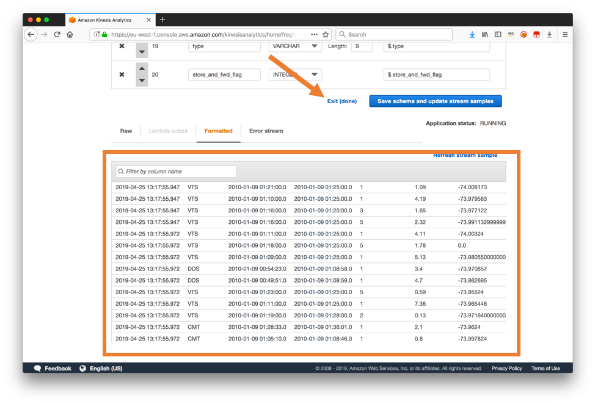

### 9.	Back in the configuration dialog of your Kinesis Analytics application, select Go to SQL editor.

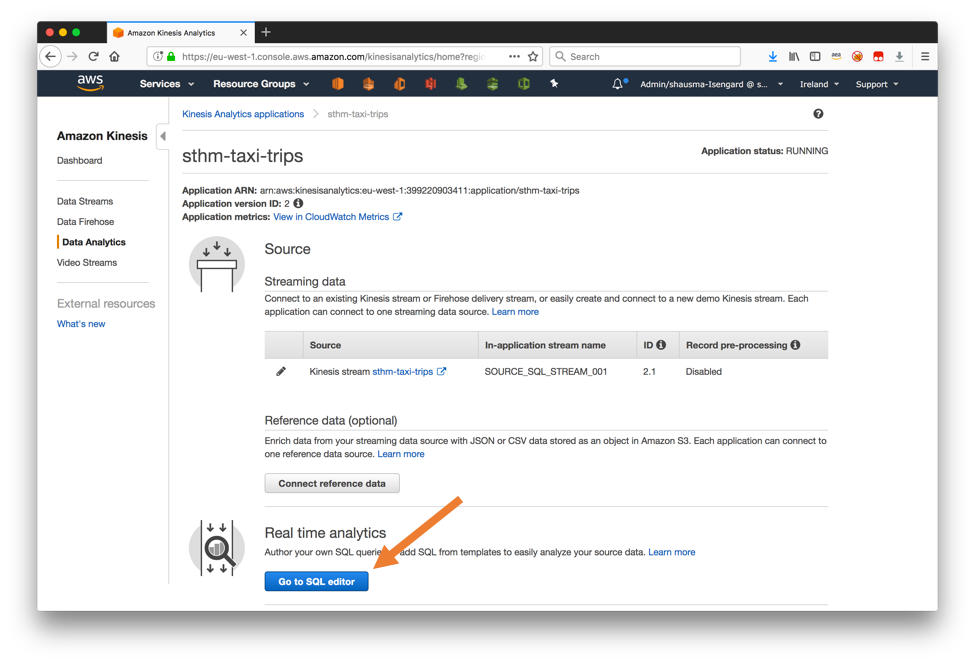

### 10.	Replace the existing code in the editor window with the following SQL code.

```
CREATE OR REPLACE STREAM cleaned_trips (
    pickup_latitude     DOUBLE,    
    pickup_longitude    DOUBLE,    
    dropoff_latitude    DOUBLE,    
    dropoff_longitude   DOUBLE,
    trip_id             BIGINT,
    trip_distance       REAL,
    passenger_count     INTEGER,
    pickup_datetime     TIMESTAMP,
    dropoff_datetime    TIMESTAMP,
    total_amount        REAL
);

CREATE OR REPLACE PUMP clean_pump AS 
    INSERT INTO cleaned_trips
        SELECT STREAM
            "pickup_latitude", 
            "pickup_longitude", 
            "dropoff_latitude", 
            "dropoff_longitude", 
            "trip_id", 
            "trip_distance", 
            "passenger_count", 
            "pickup_datetime",
            "dropoff_datetime",
            "total_amount"
        FROM source_sql_stream_001
        WHERE "type" LIKE 'trip' AND ("pickup_latitude" <> 0 AND "pickup_longitude" <> 0 AND "dropoff_latitude" <> 0 AND "dropoff_longitude" <> 0);


CREATE OR REPLACE STREAM trip_statistics (
    trip_count          INTEGER,
    passenger_count     INTEGER,
    total_amount        REAL
);

CREATE OR REPLACE PUMP statistics_pump AS 
    INSERT INTO trip_statistics
        SELECT STREAM
            COUNT(1) as trip_count, 
            SUM(passenger_count) as passenger_count, 
            SUM(total_amount) as total_amount
        FROM cleaned_trips
        GROUP BY STEP(cleaned_trips.ROWTIME BY INTERVAL '2' SECOND)
        ORDER BY STEP(cleaned_trips.ROWTIME BY INTERVAL '2' SECOND);

```

### 11.	Select Save and run to start the execution of the SQL code.

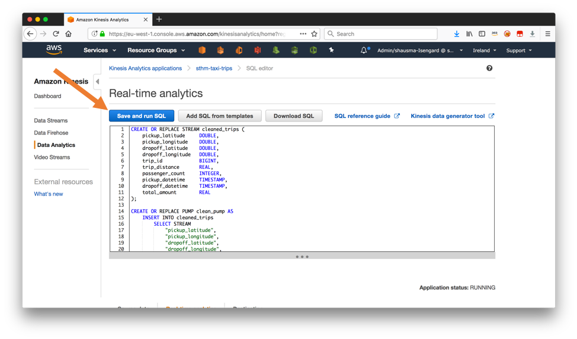

### 12.	At the bottom of the page, select TRIP_STATISTICS to observe the output of the queries in real time.

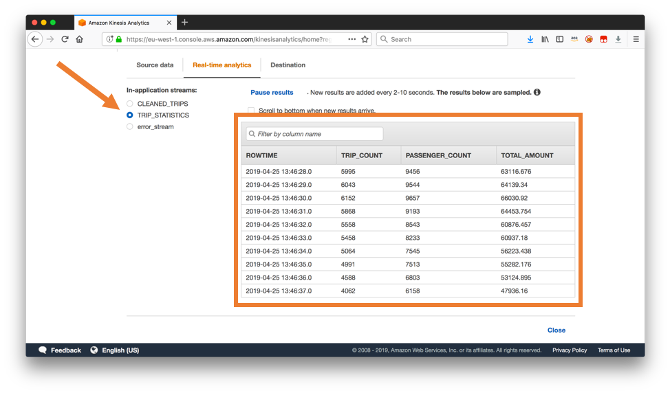

To review what we've done so far, we have defined two Streams and two Pumps.  A Stream is like an in-memory table.  A Pump is like a continuous query that is used to populate our stream.

Our first stream is called "cleaned_trips" which is populated by our "clean_pump" pump which selects only those records of the type='trip' that have valid longitude and latitudes.

Our second stream is called "trip_statistics" which is populated by our "statistics_pump" pump.  The "statistics_pump" pump calculates summary statistics for every 2 second interval.


### 13.	Extend the existing program by append the following code to the bottom of the existing SQL.

```
CREATE OR REPLACE STREAM trip_statistics_anomaly_tmp (
    trip_count          INTEGER,
    passenger_count     INTEGER,
    total_amount        REAL,
    anomaly_score       DOUBLE,
    anomaly_explanation VARCHAR(20480),
    resolution          VARCHAR(8)
);

CREATE OR REPLACE STREAM trip_statistics_anomaly (
    rowtime_ts          TIMESTAMP,
    trip_count          INTEGER,
    passenger_count     INTEGER,
    total_amount        REAL,
    anomaly_score       DOUBLE,
    anomaly_explanation VARCHAR(20480),
    resolution          VARCHAR(8)
);


CREATE OR REPLACE PUMP trip_statistics_anomaly_pump AS 
    INSERT INTO trip_statistics_anomaly
        SELECT STREAM FLOOR(trip_statistics_anomaly_tmp.ROWTIME TO SECOND) AS rowtime_ts, trip_count, passenger_count, total_amount, anomaly_score, anomaly_explanation, resolution
        FROM trip_statistics_anomaly_tmp
        ORDER BY FLOOR(trip_statistics_anomaly_tmp.ROWTIME TO SECOND), ANOMALY_SCORE DESC;

CREATE OR REPLACE PUMP trip_statistics_anomaly_60min_pump AS 
    INSERT INTO trip_statistics_anomaly_tmp
        SELECT STREAM trip_count, passenger_count, total_amount, anomaly_score, anomaly_explanation, '60min'
        FROM TABLE(RANDOM_CUT_FOREST_WITH_EXPLANATION(
            CURSOR(SELECT STREAM trip_count, passenger_count, total_amount FROM trip_statistics),
            100, 256, 100000, 24, false));

```

### 14.	Click Save and run SQL to execute the updated program.

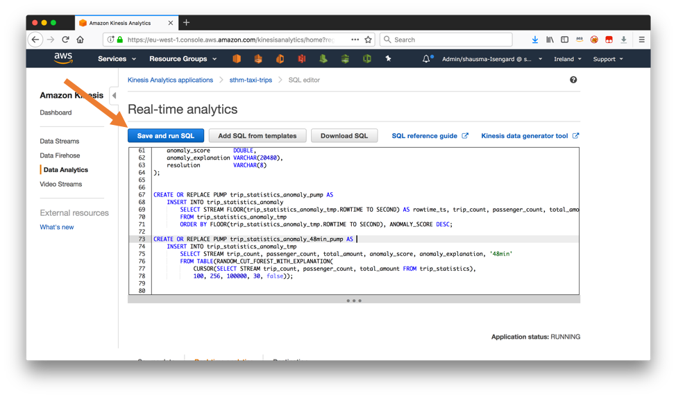

### 15.	Select TRIP_STATISTICS_ANOMALY as In-application streams.

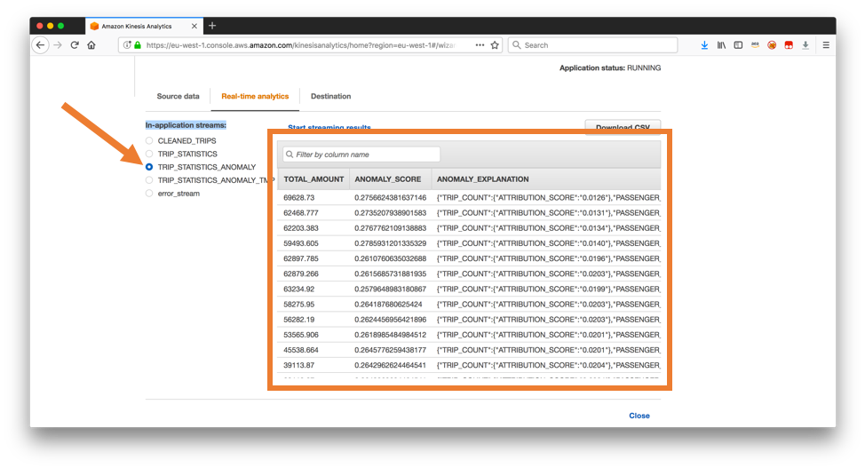

The (random cut forest algorithm)[https://docs.aws.amazon.com/kinesisanalytics/latest/sqlref/sqlrf-random-cut-forest-with-explanation.html] takes a couple of minutes to initialize (during which the ANOMALY_SCORE will be zero). Once the initialization phase has completed, you should see a meaningful ANOMALY_SCORE value and ANOMALY_SCORE_EXPLANATION. 

## Congratulations.  You have completed Immersion Day Lab3 - Clean, Aggregate, and Enrich Events with Kinesis Data Analytics SQL.

Click [here](../README.md) to return to Immersion Day table of contents.