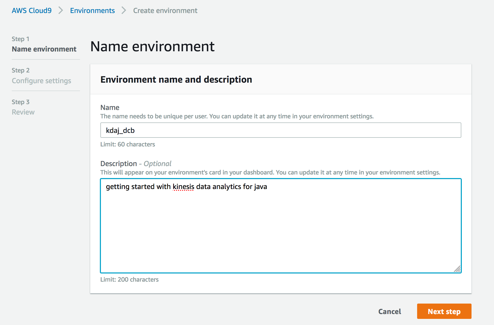
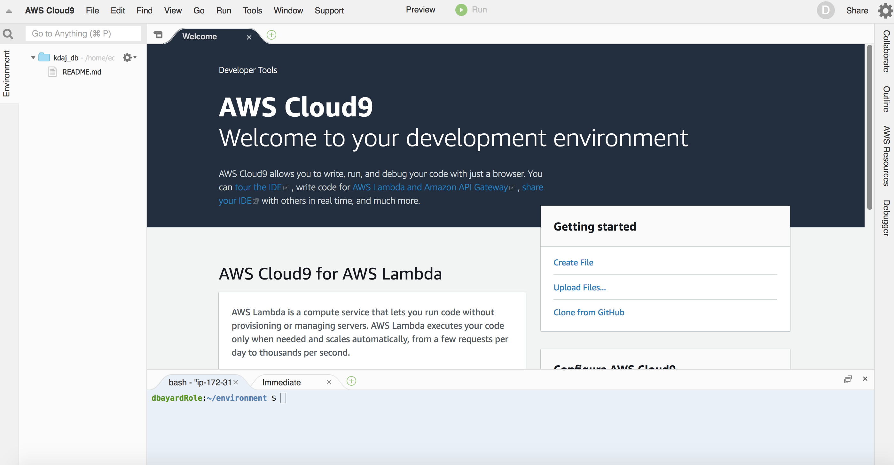
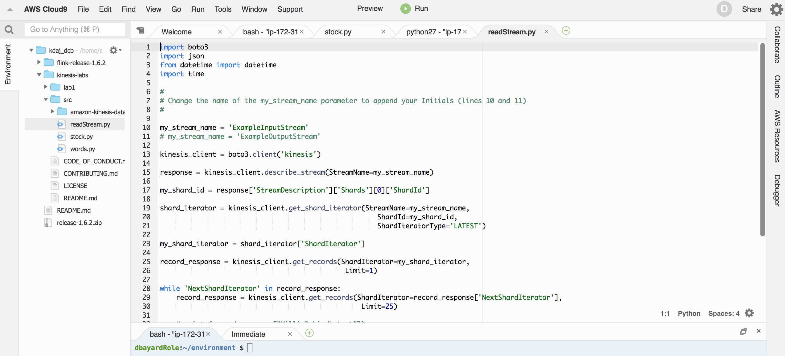
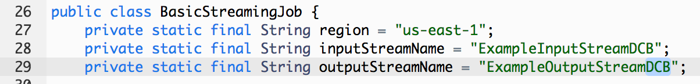
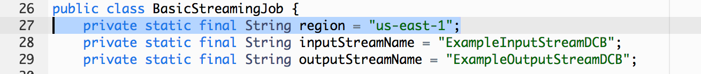
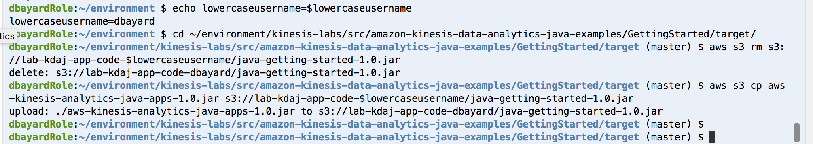
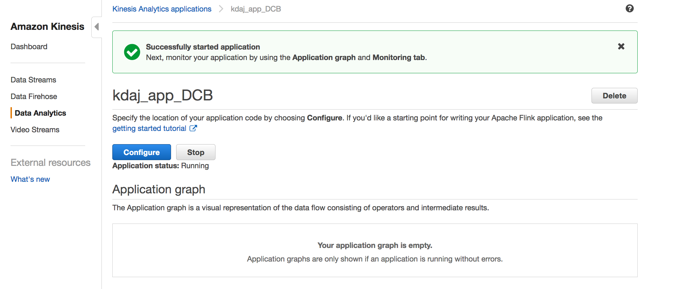
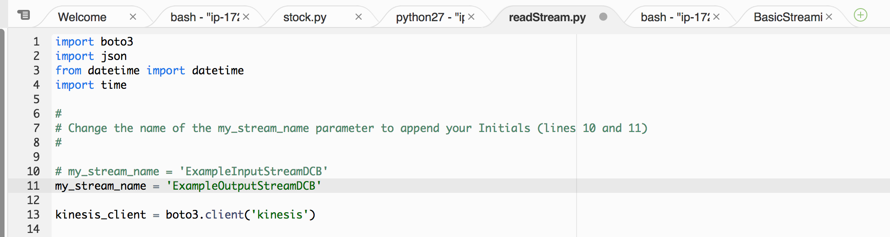
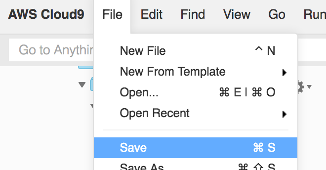
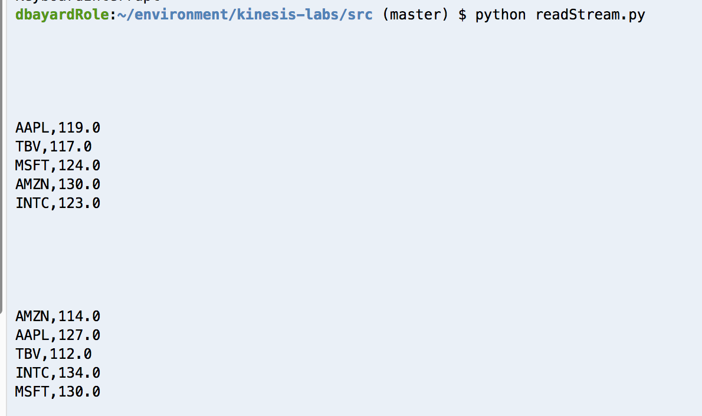

# LAB 1 - Getting Started with Kinesis Data Analytics for Java
In this lab you will learn how to get started with Kinesis Data Analytics for Java applications and Apache Flink.  First, you will setup a Cloud9 development environment and configure the pre-requisites.  Then you will build and deploy a series of sample applications that show basic Flink functionality include the use of Sources and Sinks, Tumbling Windows, and Sliding Windows.

With Amazon [Kinesis Data Analytics for Java Applications](https://docs.aws.amazon.com/kinesisanalytics/latest/java/what-is.html), you can use Java to process and analyze streaming data. The service enables you to author and run Java code against streaming sources to perform time-series analytics, feed real-time dashboards, and create real-time metrics. 

You can build Java applications in Kinesis Data Analytics using open-source libraries based on [Apache Flink](https://flink.apache.org/). Apache Flink is a popular framework and engine for processing data streams.

Kinesis Data Analytics provides the underlying infrastructure for your Apache Flink applications. It handles core capabilities like provisioning compute resources, parallel computation, automatic scaling, and application backups (implemented as checkpoints and snapshots). You can use the high-level Flink programming features (such as operators, sources, and sinks) in the same way that you use them when hosting the Flink infrastructure yourself. 

For more information, see [Kinesis Data Analytics for Java Applications: How it Works](https://docs.aws.amazon.com/kinesisanalytics/latest/java/how-it-works.html).


## Contents
* [Before You Begin](#before-you-begin)
* [Create a Cloud9 Development Environment](#Create-a-Cloud9-Development-Environment)
* [Configure prerequisites for building Kinesis Data Analytics for Java applications](#Configure-prerequisites-for-building-Kinesis-Data-Analytics-for-Java-applications)
* [Create Kinesis Streams for input and output and test them](#Create-Kinesis-Streams-for-input-and-output-and-test-them)
* [Working with the Getting Started application](#Working-with-the-Getting-Started-application)
* [Working with the Tumbling Window example application](#Working-with-the-Tumbling-Window-example-application)
* [Working with the Sliding Window example application](#Working-with-the-Sliding-Window-example-application)
* [Before You Leave](#before-you-leave)

## Before You Begin
* Determine and capture the following information.
  * [AWS_Region_to_be_used_for_Lab]
* Login to the [AWS Console](https://console.aws.amazon.com/). 
* Switch your console to the assigned [AWS Region](https://docs.aws.amazon.com/AmazonRDS/latest/UserGuide/Concepts.RegionsAndAvailabilityZones.html).  

## Create a Cloud9 Development Environment
[AWS Cloud9](https://aws.amazon.com/cloud9/) is is a cloud-based integrated development environment (IDE) that lets you write, run, and debug your code with just a browser.

AWS Cloud9 comes with a terminal that includes sudo privileges to the managed Amazon EC2 instance that is hosting your development environment and a preauthenticated AWS Command Line Interface. This makes it easy for you to directly access AWS services, install additional software, do a git push, or enter commands.

### Navigate to the Cloud9 Console

* In the AWS Console, use the Services menu and navigate to the Cloud9 console.  One way to do so, is to expand the Services top menu and type "Cloud9" in the service search field.


### Create a Cloud9 development environment

* In the Cloud9 console, click on "Create environment".  

* Enter "kdaj_[your_initials]" for the name.

Note: As multiple users may be using the same account bucket in the labs, please use your initials when creating/naming the environment.

* Fill in a description.

* Click "Next step"



* On the "Configure settings" page, leave the defaults as-is.

* Click "Next step"


* Click "Create environment"


Cloud9 will now create your new environment.  It will take a few minutes for the environment to be ready.   While waiting, you can start to review the Cloud9 IDE tutorial in the step below.

### Get familiar with Cloud9
If you are new to Cloud9, review the IDE tutorial at [https://docs.aws.amazon.com/cloud9/latest/user-guide/tutorial-tour-ide.html](https://docs.aws.amazon.com/cloud9/latest/user-guide/tutorial-tour-ide.html)


## Configure prerequisites for building Kinesis Data Analytics for Java applications
Kinesis Data Analytics for Java (KDAJ) is based on Apache Flink 1.6.2.  To build applications for KDAJ, we will need to configure Java, Maven, Apache Flink, and the Flink Connector for Kinesis.  We will do that in the following steps.

* Open up your Cloud9 environment if not already open



* Click on the + sign to the right of the Welcome Tab and use the pop-up menu to open a new Terminal tab as shown below:


* In the terminal, paste and run the following code to setup the java 1.8 environment.

```
sudo yum -y update
sudo yum -y install java-1.8.0-openjdk-devel
sudo update-alternatives --set javac /usr/lib/jvm/java-1.8.0-openjdk.x86_64/bin/javac
sudo update-alternatives --set java /usr/lib/jvm/jre-1.8.0-openjdk.x86_64/bin/java
java -version

```

When the code is finished running, you should see output like this:


* In the terminal, paste and run the following code to setup the Maven environment.

```
sudo wget http://repos.fedorapeople.org/repos/dchen/apache-maven/epel-apache-maven.repo -O /etc/yum.repos.d/epel-apache-maven.repo
sudo sed -i s/\$releasever/6/g /etc/yum.repos.d/epel-apache-maven.repo
sudo yum install -y apache-maven
mvn -version

```

When the code is finished running, you should see output like this:


* In the terminal, paste and run the following code to setup the Flink 1.6.2 environment and to compile the Kinesis connector for Flink.

```
wget https://github.com/apache/flink/archive/release-1.6.2.zip
unzip release-1.6.2.zip
cd flink-release-1.6.2
mvn clean package -B -DskipTests -Dfast -Pinclude-kinesis -pl flink-connectors/flink-connector-kinesis

```

When the code is finished running, you should see output like this:


### Download our sample code for the lab
This lab is based on the Getting Started tutorial in the Kinesis Data Analytics for Java documentation, which you can find [here](https://docs.aws.amazon.com/kinesisanalytics/latest/java/get-started-exercise.html).

Note: We have tweaked the examples slightly for simplicity.  You can find the original version of the source code [here](https://github.com/aws-samples/amazon-kinesis-data-analytics-java-examples).

* In the terminal, paste and run the following code to download the sample code for our lab.

```
cd ~/environment
git clone https://github.com/dbayardAWS/kinesis-labs.git
```

When the code is finished running, you should see output like this:


## Create Kinesis Streams for input and output and test them
In this section, we will create some Kinesis Data Streams and test them with some python producer and consumer programs that we will run in our Cloud9 ec2 instance.


* In the terminal, paste and edit and run the following code to define your Initials as a shell variable in the terminal.

```
# change DCB to your initials before running this
export INITIALS=DCB

```

As an example, in the screenshot below, the user changed the INITIALS to ABC:


* In the terminal, then paste and run the following code to create 2 kinesis streams.  The stream names will have your initials appended to them.

```
echo Initials=$INITIALS
aws kinesis create-stream \
--stream-name ExampleInputStream$INITIALS \
--shard-count 1 

aws kinesis create-stream \
--stream-name ExampleOutputStream$INITIALS \
--shard-count 1 

```

When the code is finished running, you should see output like this:


### Edit and launch the stock.py Provider

* In the Cloud9 navigator on the left-hand side, expand the kinesis-labs folder, then the src folder.  Then double-click on the stock.py file to open it in a tab in the editor.


* Find the StreamName parameter in the stock.py code and append your initials to the Stream name (to match the name of the kinesis stream you created with the "aws kinesis create-stream" command above).


* Then use the File..Save menu to save the modified stock.py file


* Use the + icon to open up a new terminal tab


* In the new terminal tab, run these commands:

```
cd kinesis-labs/src
python stock.py

```

When the code is running, the stock.py program is continually creating JSON messages with stock symbols and prices and sending them to the ExampleInputStream Kinesis Data Stream.  You should see output like this:


Leave the stock.py producer code running in its terminal tab for now.  


### Edit and launch the readStream.py Consumer

* In the Cloud9 navigator on the left-hand side, expand the kinesis-labs folder, then the src folder.  Then double-click on the readStream.py file to open it in a tab in the editor.



* Find the my_stream_name parameter in the readStream.py code and append your initials to the Stream name (do this as well for the commented out line).

Note: at this point, the my_stream_name should be set to the ExampleInputStream[Initials].  In a later exercise, we will point this consumer to the ExampleOutputStream but not yet.


* Then use the File..Save menu to save the modified readStream.py file


* Use the + icon to open up a new terminal tab


* In the new terminal tab, run these commands:

```
cd kinesis-labs/src
python readStream.py

```

When the code is running, you should see output like this:


Congratulations!  You have a running producer sending messages to one of your Kinesis Streams and you have a running consumer reading messages from the same stream.


At this point, let's stop the readStream.py consumer.

* In the terminal tab running the readStream.py, type ctrl-c to stop it.


Note: Please leave the stock.py consumer running.  If you accidentally did stop the stock.py consumer, then just restart it.


## Working with the Getting Started application
Now that we've tested that we have a working Kinesis setup, let's start with our first Kinesis Data Analytics for Java application.  We have a simple Getting Started application that we will review, compile, and ultimately deploy.

Our first application will simply read from one Kinesis Data Stream as source and write to another Kinesis Data Stream as a sink.


* In the navigator on the left-hand side, expand the kinesis-labs folder, then the src folder, all the way as shown in the below screensot until you get to the BasicStreamingJob.java file.  You may need to slide the divider between the navigator and the main editor to the right to make the navigator section wider.  Double-click on the file to open it in a tab in the editor.


* Find the inputStreamName and outputStreamName parameters in the java code and append your initials to the Stream name (to match the name of the kinesis streams you created with the "aws kinesis create-stream" command above).

Note: Be sure to edit both the inputStreamName and outputStreamName



* NOTE: If you are not running in the AWS region 'us-east-1', then you need to edit the java source code to change the "region" variable to the correct region.



* Then use the File..Save menu to save the modified BasicStreamingJob.java file


* In your left-most Terminal tab (this is where we setup the pre-requisites and set certain environment variables like INITIALS), run these commands to compile and build your KDAJ application:

```
cd ~/environment/kinesis-labs/src/amazon-kinesis-data-analytics-java-examples/GettingStarted/
mvn install:install-file -Dfile=/home/ec2-user/environment/flink-release-1.6.2/flink-connectors/flink-connector-kinesis/target/flink-connector-kinesis_2.11-1.6.2.jar -DpomFile=/home/ec2-user/environment/flink-release-1.6.2/flink-connectors/flink-connector-kinesis/target/dependency-reduced-pom.xml
mvn package

```


When the code is finished running, you should see output like this:


At this point, our Getting Started KDAJ application has been compiled and a jar file ready for deployment has been built.  The jar has been placed in the kinesis-labs/src/amazon-kinesis-data-analytics-java-examples/GettingStarted/target directory if you want to look at.

### Create an s3 bucket to upload code
Kinesis Data Analytics for Java expects the application jar file to be located on a S3 bucket.  So, we will create a S3 bucket to hold our application.


* Using the same Terminal tab you just used to compile/build your KDAJ application, paste and edit and run these commands to define a unique lowercase username (so that your S3 bucket name is unique).

```
cd ~/environment
# change "dbayard" to your username (in lowercase, no spaces) before running this
export lowercaseusername=dbayard

```

As an example, in the screenshot below, the user changed the lowercaseusername to anyuser:


* Then run paste and run the following commands to create your S3 bucket:

```
echo lowercaseusername=$lowercaseusername
aws s3 mb s3://lab-kdaj-app-code-$lowercaseusername

```

When the code is finished running, you should see output like this:


### Copy the application jar file to the s3 bucket

* Using the same Terminal tab, run these commands to copy the generated .jar file your KDAJ application to the s3 bucket:

```
echo lowercaseusername=$lowercaseusername
cd ~/environment/kinesis-labs/src/amazon-kinesis-data-analytics-java-examples/GettingStarted/target/
aws s3 rm s3://lab-kdaj-app-code-$lowercaseusername/java-getting-started-1.0.jar
aws s3 cp aws-kinesis-analytics-java-apps-1.0.jar s3://lab-kdaj-app-code-$lowercaseusername/java-getting-started-1.0.jar

```

When the code is finished running, you should see output like this:



### Use the UI to define the KDAJ application
While the AWS CLI can be used to define your application, we will use the Kinesis Console UI to do so because it demonstrates the concepts and parameters better.  To use the CLI to create an application, you can find an example [here](https://docs.aws.amazon.com/kinesisanalytics/latest/java/get-started-exercise.html#get-started-exercise-7-cli).

* In the AWS Console, use the Services menu and navigate to the Kinesis console.  One way to do so, is to expand the Services top menu and type "Kinesis" in the service search field.


* In the left-hand column, click on "Data Analytics"

* Then click on "Create application"


* On the Create Application page, enter "kdaj_app_INTITALS" for the application name, where your replace INITIALS with your initials.

  * Enter a description of your liking

  * Choose Apache Flink 1.6 for the Runtime

  * Leave the default of "Create / update IAM..." for the Access permisions

  * Click Create application


* Now the application is created but it is not yet configured.  Click Configure


* On the Configure application page, pick the S3 bucket you created earlier.  It will be named something like lab-kdaj-app-code-[lowercaseusername].

  * For the S3 object path, enter this value:

```
java-getting-started-1.0.jar
```

  * Expand Snapshots and disable them

  * Expand Monitoring and enable CloudWatch Logging.  Set the Monitoring log level to WARN.

Hint: if you ever need to debug why your KDAJ application isn't working, you may need to change this Monitoring log level to INFO at a later point.

* Click the Update button


### Add permissions to the generated IAM policy for your application
Even though the KDAJ Console generated an IAM policy for your application, the Console does not know that your java code wants to read the ExampleInputStream kinesis stream and write to the ExampleOutputStream kinesis stream.  As such, the Console UI didn't add those permissions to your applications IAM policy.

Let's now edit the application's policy to add permissions so that the application can run OK.

* In the Kinesis console for your KDAJ application, scroll down to the details section of the page.  Look for the IAM role section and click on the link to open the IAM role in the IAM console.


* Click on "Add inline policy"


* Click on the JSON tab


* Copy the following JSON and paste it over the contents in the JSON editor.  Then, you will need to make 4 edits:


```
{
    "Version": "2012-10-17",
    "Statement": [
        {
            "Sid": "ReadInputStream",
            "Effect": "Allow",
            "Action": "kinesis:*",
            "Resource": "arn:aws:kinesis:us-east-1:1234567890:stream/ExampleInputStream"
        },
        {
            "Sid": "WriteOutputStream",
            "Effect": "Allow",
            "Action": "kinesis:*",
            "Resource": "arn:aws:kinesis:us-east-1:1234567890:stream/ExampleOutputStream"
        },
        {
            "Sid": "KPLCloudwatch",
            "Effect": "Allow",
            "Action": [
              "cloudwatch:PutMetricData"
            ],
            "Resource": [
              "*"
            ]
        }
    ]
}        

```


  * Append your initials to the stream name (you will do this for both the ExampleInputStream and the ExampleOutputStream)

  * Replace the sample account ID (1234567890) with your account ID.  Hint: you can lookup your account ID by going back to your Kinesis console tab.  On the web page for your Kinesis Analytics application, you will see your account ID in details section as part of the Application ARN field.


Here is an example of the JSON post-edits:


* Having made the edits for your Initials and account id, then click the "Review policy" button.

* Then define a name for your policy, such as "KDAJ_stream_permissions" and click "Create policy"


### Now run your application

* Navigate back to your application in the Kinesis console in the browser.

* Now run the application by clicking the Run button and when it asks if you are sure, click the Run button again


At this point, your Flink application is starting.  It will take a few minutes to start.

* Wait until the Application Status says running



* Hint: You may need to use the browser's refresh button to get the visual Application Graph to display


### Edit the readStream.py consumer
Now that our Getting Started KDAJ application is running, let's edit our readStream.py consumer to show the contents of the ExampleOutputStream.  Our Getting Started application should be reading from the ExampleInputStream and writing to the ExampleOutputStream.

* Go back to your Cloud9 IDE browser page.  Click on the existing tab for the readStream.py file.

* Edit readStream.py file by commenting out the line that sets my_stream_name to the ExampleInputStream and uncommenting the line that sets the my_stream_name to the ExampleOutputStream



* Save the changes


* Run the file in a terminal tab with this command:

```
cd ~/environment/kinesis-labs/src
python readStream.py

```


While the code is running, you should see output like this:


Congratulations!  You have a running Kinesis Data Analytics for Java application reading messages from one of your Kinesis Streams and writing messages to a different stream.


If you are curious how this worked, review the BasicStreamingJob.java source code, specifically the main() code:


Notice that the code gets the StreamExecutionEnvironment, then creates a DataStream from a source, adds a sink, and then executes the environment.

You can learn more about Flink coding [here](https://ci.apache.org/projects/flink/flink-docs-release-1.6/).

At this point, let's stop the readStream.py consumer.

* In the terminal tab running the readStream.py, type ctrl-c to stop it.


## Working with the Tumbling Window example application
Next, we will move to a more complex example.  This example will implement a version of the classic "word count".  Specifically, the example will calculate the # of times that each stock symbol appears during each 5 second time window.


This example is based on the TumblingWindow tutorial in the Kinesis Data Analytics for Java documentation, which you can find [here](https://docs.aws.amazon.com/kinesisanalytics/latest/java/examples-tumbling.html).

Note: We have tweaked the examples slightly for simplicity.  You can find the original version of the source code [here](https://github.com/aws-samples/amazon-kinesis-data-analytics-java-examples).

The application uses the timeWindow operator to find the count of stock symbols over a 5-second tumbling window.  Learn more about Windows in Flink [here](https://flink.apache.org/news/2015/12/04/Introducing-windows.html).


The above diagram is from the Flink web page on Windows.

The application code is located in the TumblingWindowStreamingJob.java file

* In the navigator on the left-hand side, expand the kinesis-labs folder, then the src folder, all the way as shown in the below screensot until you get to the TumblingWindoStreamingJob.java file.  You may need to slide the divider between the navigator and the main editor to the right to make the navigator section wider.  Double-click on the file to open it in a tab in the editor.


* Find the inputStreamName and outputStreamName parameters in the java code and append your initials to the Stream name (to match the name of the kinesis streams you created with the "aws kinesis create-stream" command above).

Note: Be sure to edit both the inputStreamName and outputStreamName


* NOTE: If you are not running in the AWS region 'us-east-1', then you need to edit the java source code to change the "region" variable to the correct region.


* Then use the File..Save menu to save the modified TumblingWindowStreamingJob.java file



* In your left-most Terminal tab (or open a new Terminal tab if you wish), run these commands to compile and build your KDAJ application:

```
cd ~/environment/kinesis-labs/src/amazon-kinesis-data-analytics-java-examples/TumblingWindow/
mvn package

```

When the code is finished running, you should see output like this:


At this point, our Tumbling Window KDAJ application has been compiled and a jar file ready for deployment has been built.  The jar has been placed in the kinesis-labs/src/amazon-kinesis-data-analytics-java-examples/TumblingWindow/target directory if you want to look at.

### Copy the application jar file to the s3 bucket

* Using the same Terminal tab, run these commands to copy the generated .jar file your KDAJ application to the s3 bucket:

```
echo lowercaseusername=$lowercaseusername
cd ~/environment/kinesis-labs/src/amazon-kinesis-data-analytics-java-examples/TumblingWindow/target/
aws s3 rm s3://lab-kdaj-app-code-$lowercaseusername/java-getting-started-1.0.jar
aws s3 cp aws-kinesis-analytics-java-apps-1.0.jar s3://lab-kdaj-app-code-$lowercaseusername/java-getting-started-1.0.jar

```

When the code is finished running, you should see output like this:


### Update our KDAJ application via the CLI to pickup the new jar file

* Paste and run these commands

```
echo INITIALS=$INITIALS
aws kinesisanalyticsv2 list-applications

```

* Make a note of the application-version-id in the output.  For example, in the below screenshot, the application-version-id is 3


* Paste, edit, and run the following commands.  Change the current-application-version-id to be the value seen in the list-applications command.

```
aws kinesisanalyticsv2 update-application \
      --application-name kdaj_app_$INITIALS \
      --application-configuration-update "{\"ApplicationCodeConfigurationUpdate\": { \"CodeContentUpdate\": {\"S3ContentLocationUpdate\": { \"BucketARNUpdate\": \"arn:aws:s3:::lab-kdaj-app-code-$lowercaseusername\",  \"FileKeyUpdate\": \"java-getting-started-1.0.jar\"}}}}" \
      --current-application-version-id 1      
```

You will see output like this:


Hint: To learn more about using AWS CLI to update KDAJ applications, refer to [here](https://docs.aws.amazon.com/kinesisanalytics/latest/java/get-started-exercise.html#get-started-exercise-7)

* Run this command until the ApplicationStatus changes from UPDATING to RUNNING

```
aws kinesisanalyticsv2 list-applications

```

Wait until you see the ApplicationStatus equal to RUNNING like this:


* If you want, go to your Kinesis console and refresh the page for your KDAJ application to see the new visual Application Graph


### Test your TumblingWindow Word Count application

* Run the readStream.py consumer

```
cd kinesis-labs/src
python readStream.py

```

You should see output every 5 seconds that lists a Stock Symbol and the number of times during the 5 second window that the Stock Symbol appeared in the Kinesis stream.



Congratulations, you have successfully run the TumblingWindow example.


If you are curious how this worked, review the TumblingWindow.java source code, specifically the main() code:


Lines 67-70 parse and tokenize the JSON into a tuple of (StockSymbol, 1.0).

Line 71 partitions the DataStream by the StockSymbol, so that each Stock Symbol is calculated individually.

Line 72 defines the TumblingWindow for 5 seconds.

Line 73 sums the 1st (0-based) element of the tuple for each partition.  Because the 1st (0-based) element of every tuple is the number 1, this is equivalent to count the # of tuples for each StockSymbol.

Line 74 translates the output to a string of the StockSymbol concatenated by of the sum from line 73.

Line 75 sends the output to a sink based on our ExampleOutputStream Kinesis Stream.


You can learn more about Flink coding [here](https://ci.apache.org/projects/flink/flink-docs-release-1.6/).


* When you are ready, type ctrl-c in the terminal tab to stop the readStream.py program


## Working with the Sliding Window example application
Now, we will test a different kind of Window- the Sliding Window.  This example will calculate the minimum price for each stock symbol over a 10-second window that slides by 5 seconds.  This example also introduces parallelism and how to configure it.


This example is based on the SlidingWindow tutorial in the Kinesis Data Analytics for Java documentation, which you can find [here](https://docs.aws.amazon.com/kinesisanalytics/latest/java/examples-sliding.html.

Note: We have tweaked the examples slightly for simplicity.  You can find the original version of the source code [here](https://github.com/aws-samples/amazon-kinesis-data-analytics-java-examples).

To learn more about Windows in Flink, you can go [here](https://flink.apache.org/news/2015/12/04/Introducing-windows.html).


The above diagram is from the Flink web page on Windows.

The application code is located in the SlidingWindowStreamingJobWithParallelism.java file

* In the navigator on the left-hand side, expand the kinesis-labs folder, then the src folder, all the way as shown in the below screensot until you get to the SlidingWindowStreamingJobWithParallelism.java file.  You may need to slide the divider between the navigator and the main editor to the right to make the navigator section wider.  Double-click on the file to open it in a tab in the editor.


* Find the inputStreamName and outputStreamName parameters in the java code and append your initials to the Stream name (to match the name of the kinesis streams you created with the "aws kinesis create-stream" command above).

Note: Be sure to edit both the inputStreamName and outputStreamName


* NOTE: If you are not running in the AWS region 'us-east-1', then you need to edit the java source code to change the "region" variable to the correct region.


* Then use the File..Save menu to save the modified SlidingWindowStreamingJobWithParallelism.java file


* In your left-most Terminal tab (or open a new Terminal tab if you wish), run these commands to compile and build your KDAJ application:

```
cd ~/environment/kinesis-labs/src/amazon-kinesis-data-analytics-java-examples/SlidingWindow/
mvn package

```

When the code is finished running, you should see output like this:


At this point, our Sliding Window KDAJ application has been compiled and a jar file ready for deployment has been built.  The jar has been placed in the kinesis-labs/src/amazon-kinesis-data-analytics-java-examples/SlidingWindow/target directory if you want to look at.

### Copy the application jar file to the s3 bucket

* Using the same Terminal tab, run these commands to copy the generated .jar file your KDAJ application to the s3 bucket:

```
echo lowercaseusername=$lowercaseusername
cd ~/environment/kinesis-labs/src/amazon-kinesis-data-analytics-java-examples/SlidingWindow/target/
aws s3 rm s3://lab-kdaj-app-code-$lowercaseusername/java-getting-started-1.0.jar
aws s3 cp aws-kinesis-analytics-java-apps-1.0.jar s3://lab-kdaj-app-code-$lowercaseusername/java-getting-started-1.0.jar

```

When the code is finished running, you should see output like this:


### Update our KDAJ application via the CLI to pickup the new jar file

* Paste and run these commands

```
echo INITIALS=$INITIALS
aws kinesisanalyticsv2 list-applications

```

* Make a note of the application-version-id in the output.  For example, in the below screenshot, the application-version-id is 3


* Paste, edit, and run the following commands.  Change the current-application-version-id to be the value seen in the list-applications command.

```
aws kinesisanalyticsv2 update-application \
      --application-name kdaj_app_$INITIALS \
      --application-configuration-update "{\"FlinkApplicationConfigurationUpdate\": { \"ParallelismConfigurationUpdate\": {\"ParallelismUpdate\": 5, \"ConfigurationTypeUpdate\": \"CUSTOM\" }}, \"ApplicationCodeConfigurationUpdate\": { \"CodeContentUpdate\": {\"S3ContentLocationUpdate\": { \"BucketARNUpdate\": \"arn:aws:s3:::lab-kdaj-app-code-$lowercaseusername\",  \"FileKeyUpdate\": \"java-getting-started-1.0.jar\"}}}}" \
      --current-application-version-id 2      
```

Note: In the above command, we are also updating the parallelism for our application.  More details about this are in the java source code or [here](https://docs.aws.amazon.com/kinesisanalytics/latest/java/examples-sliding.html).

When you run the above code, you will see output like this:


Hint: To learn more about using AWS CLI to update KDAJ applications, refer to [here](https://docs.aws.amazon.com/kinesisanalytics/latest/java/get-started-exercise.html#get-started-exercise-7)

* Run this command until the ApplicationStatus changes from UPDATING to RUNNING

```
aws kinesisanalyticsv2 list-applications

```

Wait until you see the ApplicationStatus equal to RUNNING like this:


* If you want, go to your Kinesis console and refresh the page for your KDAJ application to see the new visual Application Graph


### Test your SlidingWindow application

* Run the readStream.py consumer

```
cd kinesis-labs/src
python readStream.py

```

You should see output every 5 seconds that lists a Stock Symbol and the minimum price of the Stock Symbol over the last 10 seconds.


Congratulations, you have successfully run the Sliding Window example.


If you are curious how this worked, review the SlidingWindowJobWithParallelism.java source code, specifically the main() code:


Lines 76-79 parse and tokenize the JSON into a tuple of (StockSymbol, Price).

Line 80 partitions the DataStream by the StockSymbol, so that each Stock Symbol is calculated individually.

Line 81 defines the Sliding Window for 10 seconds calculated every 5 seconds.

Line 82 finds the minimum of the 1st (0-based) element of the tuple for each partition.  Because the 1st (0-based) element of every tuple is the price, this is equivalent to finding the minimum price for each StockSymbol.

Line 83 sets the Parallelism to a non-default value (just to show how to do it).

Line 84 translates the output to a string of the StockSymbol concatenated by of the minimum from line 82.

Line 85 sends the output to a sink based on our ExampleOutputStream Kinesis Stream.

You can learn more about Flink coding [here](https://ci.apache.org/projects/flink/flink-docs-release-1.6/).


* When you are ready, type ctrl-c in the terminal tab to stop the readStream.py program


## Before You Leave
If you are done with all of the labs, please follow the cleanup instructions to avoid having to pay for unused resources.


