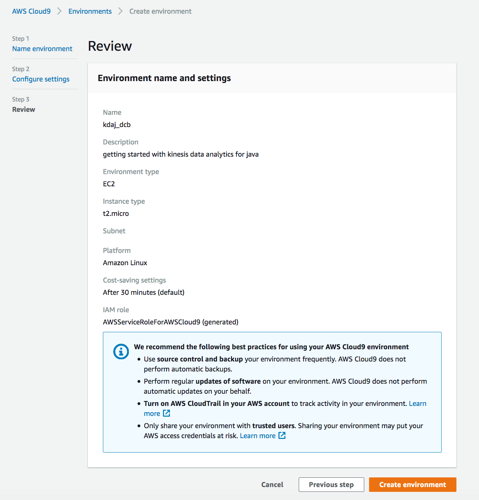
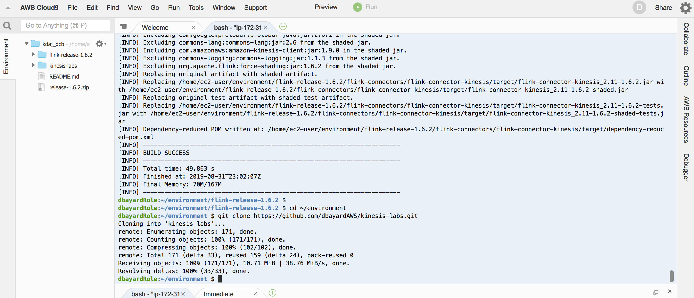
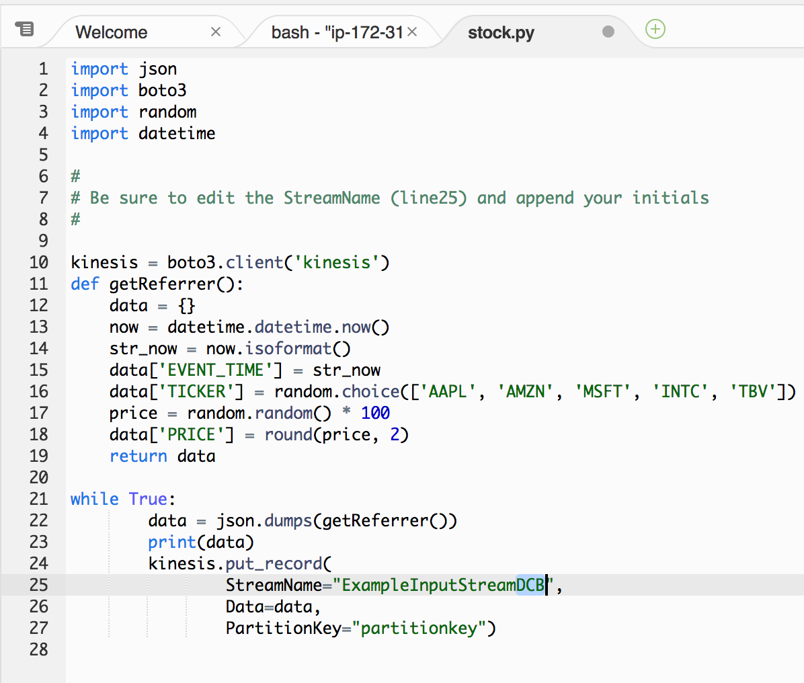
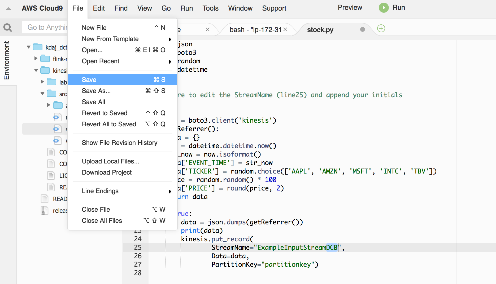
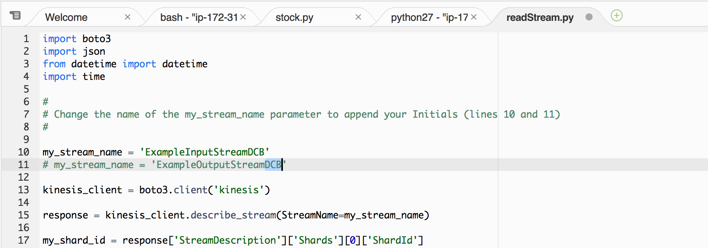
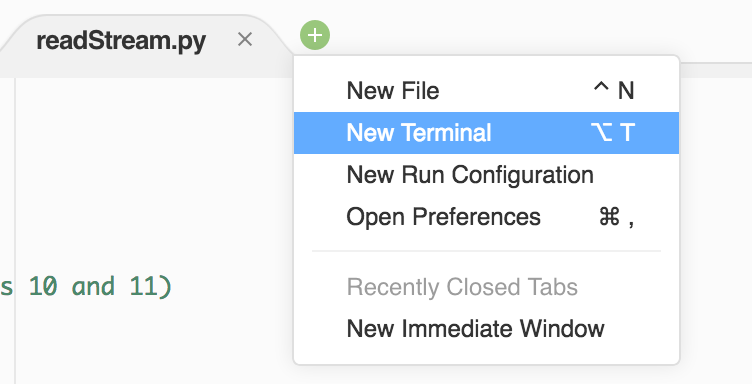
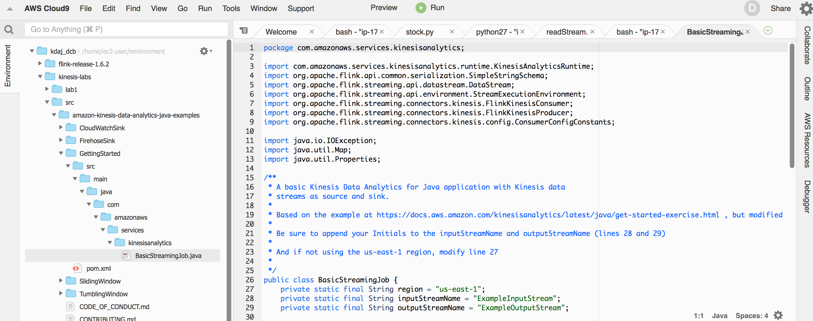
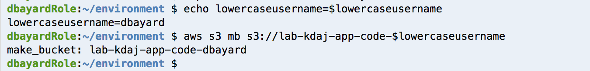
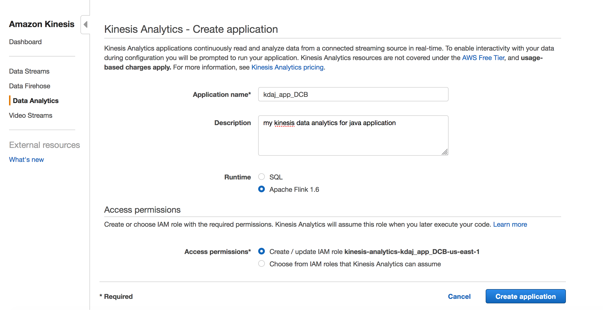
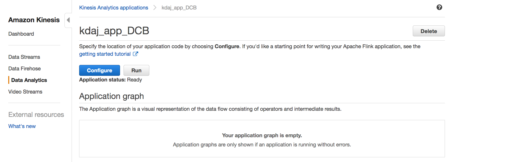

# LAB 1 - Getting Started with Kinesis Data Analytics for Java
In this lab you will setup a basic data lake environment, load some data, and begin to use it.


## Contents
* [Before You Begin](#before-you-begin)
* [Setup your initial Data Lake on S3](#setup-your-initial-data-lake-on-s3)
* [Catalog our new dataset](#catalog-our-new-dataset)
* [Query our new data](#query-our-new-data)
* [OPTIONAL Make our data faster](#optional-make-our-data-faster)
* [Before You Leave](#before-you-leave)

## Before You Begin
* Determine and capture the following information.
  * [Your_AWS_Account_Id]
  * [Your_AWS_User_Name]
  * [Your_AWS_Password]
  * [AWS_Region_to_be_used_for_Lab]
* Login to the [AWS Console](https://console.aws.amazon.com/). 
* Switch your console to the assigned [AWS Region](https://docs.aws.amazon.com/AmazonRDS/latest/UserGuide/Concepts.RegionsAndAvailabilityZones.html).  

## Create a Cloud9 Development Environment
Cloud9 is ...

We will use Cloud9 for ...

Learn more [here](https://aws.amazon.com/products/storage/data-lake-storage/).

### Navigate to the Cloud9 Console

* In the AWS Console, use the Services menu and navigate to the Cloud9 console.  One way to do so, is to expand the Services top menu and type "Cloud9" in the service search field.


### Create a Cloud9 development environment

* In the Cloud9 console, click on "Create environment".  

* Enter "kdaj-[your_initials]" for the name.

Note: As multiple users may be using the same account bucket in the labs, please use your initials when creating/naming the environment.

* Fill-in a description.

* Click "Next Step"


* On the "Configure settings" page, leave the defaults as-is.

* Click "Next Step"


* Click "Create Environment"



A new browser tab will open for your new environment.  It will take a few minutes for the environment to be ready.   While waiting, you can review the Cloud9 IDE tutorial in the step below.

### Get familiar with Cloud9
If new to Cloud9, review the IDE tutorial at [https://docs.aws.amazon.com/cloud9/latest/user-guide/tutorial.html#tutorial-tour-ide](https://docs.aws.amazon.com/cloud9/latest/user-guide/tutorial.html#tutorial-tour-ide)


### Configure your Cloud9 environment for the prerequisites

* Open up your Cloud9 environment if not already open


* Click on the + sign to use the pop-up menu to open a new Terminal tab


* In the terminal, paste and run the following code to setup the java 1.8 environment.

```
sudo yum -y update
sudo yum -y install java-1.8.0-openjdk-devel
sudo update-alternatives --set javac /usr/lib/jvm/java-1.8.0-openjdk.x86_64/bin/javac
sudo update-alternatives --set java /usr/lib/jvm/jre-1.8.0-openjdk.x86_64/bin/java
java -version

```


* In the terminal, paste and run the following code to setup the Maven environment.

```
sudo wget http://repos.fedorapeople.org/repos/dchen/apache-maven/epel-apache-maven.repo -O /etc/yum.repos.d/epel-apache-maven.repo
sudo sed -i s/\$releasever/6/g /etc/yum.repos.d/epel-apache-maven.repo
sudo yum install -y apache-maven
mvn -version

```


* In the terminal, paste and run the following code to setup the Flink 1.6.2 environment and to compile the Kinesis connector for Flink.

```
wget https://github.com/apache/flink/archive/release-1.6.2.zip
unzip release-1.6.2.zip
cd flink-release-1.6.2
mvn clean package -B -DskipTests -Dfast -Pinclude-kinesis -pl flink-connectors/flink-connector-kinesis

```


### Download our sample code
Find out more about the sample code [here](https://docs.aws.amazon.com/kinesisanalytics/latest/java/get-started-exercise.html).

Note: We have tweaked the examples slightly.

* In the terminal, paste and run the following code to setup the Flink 1.6.2 environment and to compile the Kinesis connector for Flink.

```
cd ~/environment
git clone https://github.com/dbayardAWS/kinesis-labs.git
```




## Create Kinesis Streams for input and output

```
# change DB to your initials before running this
export INITIALS=DB

```


```
echo Initials=$INITIALS
aws kinesis create-stream \
--stream-name ExampleInputStream$INITIALS \
--shard-count 1 

aws kinesis create-stream \
--stream-name ExampleOutputStream$INITIALS \
--shard-count 1 

```


### Edit and launch the stocks.py Provider

* In the Cloud9 navigator on the left-hand side, expand the kinesis-labs folder, then the src folder.  Then double-click on the stock.py file to open it in a tab in the editor.


* Find the StreamName parameter in the stock.py code and append your initials to the Stream name (to match the name of the kinesis stream you created with the "aws kinesis create-stream" command above).



* Then use the File..Save menu to save the modified stock.py file



* Use the + icon to open up a new terminal tab


* In the new terminal tab, run these commands:

```
cd kinesis-labs/src
python stock.py

```


### Edit and launch the readOutputStream Consumer

* In the Cloud9 navigator on the left-hand side, expand the kinesis-labs folder, then the src folder.  Then double-click on the readOutputStream.py file to open it in a tab in the editor.


* Find the my_stream_name parameter in the readOutputStream.py code and append your initials to the Stream name (to match the name of the kinesis input stream you created with the "aws kinesis create-stream" command above).

Note: at this point, the my_stream_name should be set to the ExampleInputStream[Initials].  In a later exercise, we will point this consumer to the ExampleOutputStream but not yet.



* Then use the File..Save menu to save the modified readOutputStream.py file


* Use the + icon to open up a new terminal tab



* In the new terminal tab, run these commands:

```
cd kinesis-labs/src
python readOutputStream.py

```


You should see the messages from the Kinesis stream printed out to the console.

* In the terminal tab running the readOutputStream.py, type ctrl-c to stop it.


### Edit the Getting Started KDAJ application and compile it

* In the navigator on the left-hand side, expand the kinesis-labs folder, then the src folder, all the way as shown in the below screensot until you get to the BasicStreamingJob.java file.  Double-click on the file to open it in a tab in the editor.



* Find the inputStreamName and outputStreamName parameters in the java code and append your initials to the Stream name (to match the name of the kinesis streams you created with the "aws kinesis create-stream" command above).

Note: Be sure to edit both the inputStreamName and outputStreamName


* Then use the File..Save menu to save the modified BasicStreamingJob.java file


* In your left-most Terminal tab (or open a new Terminal tab if you wish), run these commands to compile and build your KDAJ application:

```
cd ~/environment/kinesis-labs/src/amazon-kinesis-data-analytics-java-examples/GettingStarted/
mvn install:install-file -Dfile=/home/ec2-user/environment/flink-release-1.6.2/flink-connectors/flink-connector-kinesis/target/flink-connector-kinesis_2.11-1.6.2.jar -DpomFile=/home/ec2-user/environment/flink-release-1.6.2/flink-connectors/flink-connector-kinesis/target/dependency-reduced-pom.xml
mvn package

```


### Create an s3 bucket to upload code

* Using the same Terminal tab you just used to compile/build your KDAJ application, run these 2 sets commands to create a new S3 bucket.  Be sure to redefine the lowercaseusername to your username:

```
# change "dbayard" to your username (in lowercase, no spaces) before running this
export lowercaseusername=dbayard

```

```
echo lowercaseusername=$lowercaseusername
aws s3 mb s3://lab-kdaj-app-code-$lowercaseusername

```



### copy the jar file to the s3 bucket

* Using the same Terminal tab, run these commands to copy the generated .jar file your KDAJ application to the s3 bucket:

```
echo lowercaseusername=$lowercaseusername
cd ~/environment/kinesis-labs/src/amazon-kinesis-data-analytics-java-examples/GettingStarted/target/
aws s3 rm s3://lab-kdaj-app-code-$lowercaseusername/java-getting-started-1.0.jar
aws s3 cp aws-kinesis-analytics-java-apps-1.0.jar s3://lab-kdaj-app-code-$lowercaseusername/java-getting-started-1.0.jar

```


### use the UI to define the KDAJ application

* In the AWS Console, use the Services menu and navigate to the Kinesis console.  One way to do so, is to expand the Services top menu and type "Kinesis" in the service search field.


* In the left-hand column, click on "Data Analytics"

* Then click on "Create application"


* On the Create Application page, enter "kdaj_app_INTITALS" for the application name, where your replace INITIALS with your initials.

* Enter a description of your liking

* Choose Apache Flink 1.6 for the Runtime

* Leave the default of "Create / update IAM..." for the Access permisions

* Click Create application



* Now the application is created but it is not yet configured.  Click Configure


* On the Configure application page, pick the S3 bucket you created earlier.  It will be named something like lab-kdaj-app-code-[lowercaseusername].

* For the S3 object path, enter this value:

```
java-getting-started-1.0.jar
```

* Expand Snapshots and disable them

* Expand Monitoring and enable Cloudwatch Logging

* Click the Update button


* Now run the application by clicking the Run button and when it asks if you are sure, click the Run button again



At this point, your Flink application is starting.  It may take a few minutes to start.

* Wait until the Application Status says running


### run the python producer and consumer


## Before You Leave
If you are done with all of the labs, please follow the cleanup instructions to avoid having to pay for unused resources.

Note: you will use the datasets created in this lab in the next lab, so don't delete them until you are finished with all of the labs.
